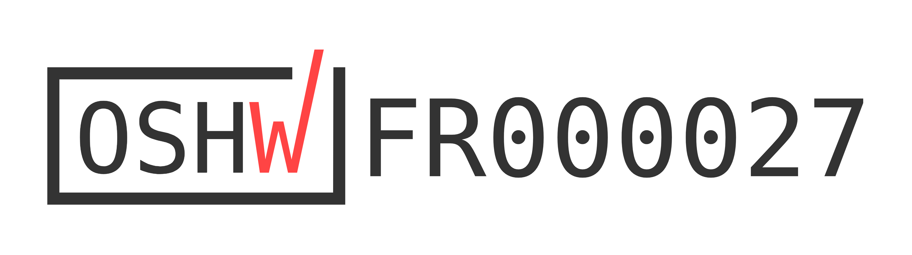

<figure>

</figure>

# BrailleRAP

## Introduction
Based on a [RepRap 3d printer controller](https://reprap.org/wiki/RepRap), [BrailleRAP](https://github.com/braillerap/BrailleRap) is an open hardware device to emboss Braille text and/or Vector graphics. You can use software like [AccessBrailleRAP](https://github.com/braillerap/AccessBrailleRAP) or [DesktopBrailleRAP](https://github.com/braillerap/DesktopBrailleRAP) to translate text in Braille and build tangible documents with the device. Some tools like [OpenStreetTouch](https://github.com/braillerap/OpenStreetTouch) can help you extract data from [OpenStreetMap](https://www.openstreetmap.org) to build public transport guide or small area city map.

BrailleRAP now exist in 2 different sizes: **BrailleRAP** and **BrailleRAP XL**. 
- **BrailleRAP** emboss sheet up to 210x297 mm. Lightweight, a completed device will weight less than 5 kg and fit in cabin travel case. 
- **BrailleRAP XL** emboss sheet up to 297x420 mm. A larger surface if you need more space to emboss vector graphics. 

<figure>

</figure>

<figure>

</figure>

You may also find some interest in [OpenStreetTangible](https://github.com/braillerap/OpenStreetTangible), a tangible subway map of the Rennes city in France. A custom build to demonstrate the ability of OpenStreetTouch and BrailleRAP to build accessible map.

## OSHWA Certification

BrailleRAP is [OSHWA](https:oshwa.org) open source hardware certified.

## Building manual
The building manual translation files are available [on codeberg weblate host](https://translate.codeberg.org/projects/braillerap-building-manual/) . If you need the building manual in your language, feel free to contribute on codeberg/weblate.    

## Funding

This project is funded through [NGI0 Entrust](https://nlnet.nl/entrust), a fund established by [NLnet](https://nlnet.nl) with financial support from the European Commission's [Next Generation Internet](https://ngi.eu) program. Learn more at the [NLnet project page](https://nlnet.nl/project/BrailleRAP).

## BrailleRap 6.6 Building Manual

Embosseuse Braille Open Source DIY

La documentation complete [est disponible ici braillerap.readthedocs.io](https://braillerap.readthedocs.io/fr/latest/index.html).

==========================================================================

DIY Open Source Braille embosser

The full documentation [is available at braillerap-en.readthedocs.io](https://braillerap-en.readthedocs.io/en/latest/index.html).

## Repository Structure

### `docs/`
The source file for readthedoc documentation, viewable at [braillerap.readthedocs.io](https://braillerap.readthedocs.io/fr/latest/index.html).

### `lasercut/`
SVG/DXF file for laser cut

### `MarlinBraille/`
BrailleRAP Firmware for MKS GEN 1.4 & MKS GEN L 2.1.

The firmware is already configured for DRV8825 stepper drivers.

### `printed_parts/`
STL files for 3D printed parts.

There is an xlsx (3D printed parts excel board.xlsx) files that detail the parts to print.

### `NatBrailleTools/`
Java source code for NatBraille BrailleRAP driver. This is obsolete now. Consider using AccessBrailleRAP (https://github.com/braillerap/AccessBrailleRAP) instead.
