# BrailleRAP Assembly Manual

## Required tools

- Small pliers
- Small cutting pliers
- M3 tap
- 8mm drill bit
- 3mm drill bit
- Hex keys: 1.5mm, 2mm, 2.5mm, and 4mm
- Socket wrenches: 5.5mm and 8mm
- Wood glue or appropriate glue for choosen material
- Blue painter's tape
- Clamping pliers
- A Whetstone for Braille stylus manufactoring

## Materials list

| Category                   | Item                                 | Quantity (BrailleRAP) | Quantity (BrailleRAP XL) | Notes                            |
| -------------------------- | ------------------------------------ | --------------------- | ------------------------ | -------------------------------- |
| **Hardware - M3 Screws**   | M3-6 grub screws                     | 5                     | 8                        | For paper rolls                  |
|                            | M3-8 screws                          | 18                    | 18                       | Motor mounting                   |
|                            | M3-12 grub screws                    | 8                     | 8                        | Axis supports & switches         |
|                            | M3-12 screws                         | 8                     | 8                        | Y motor & general assembly       |
|                            | M3-14 screws                         | 32                    | 36                       | General assembly                 |
|                            | M3-16 grub screws                    | 2                     | 2                        | Braille stylus & solenoid        |
|                            | M3-16 screws                         | 8                     | 8                        | Paper guides & door              |
|                            | M3-20 screws                         | 15                    | 19                       | Carriage & belt attachment       |
|                            | M3-25 screws                         | 5                     | 6                        | Pulleys & clipboard              |
|                            | M3-30 grub screws                    | 1                     | 1                        | Top carriage assembly            |
| **Hardware - M5 Screws**   | M5-18 screws                         | 4                     | 4                        | KFL8 mounting                    |
|                            | M5-25 screws                         | 4                     | 4                        | KP08 mounting                    |
| **Hardware - M2.5 Screws** | M2.5-14 screws                       | 4                     | 4                        | Limit switches                   |
| **Hardware - Nuts**        | M3 nuts                              | 12                    | 12                       | General assembly                 |
|                            | M3 nyloc nuts                        | 33                    | 39                       | Locking nuts                     |
|                            | M3 blind nuts                        | 1                     | 1                        | Top carriage                     |
|                            | M5 nuts                              | 8                     | 8                        | KP08 & KFL8                      |
|                            | M2.5 nyloc nuts                      | 4                     | 4                        | Limit switches                   |
| **Hardware - Washers**     | M3 washers                           | 8                     | 8                        | General assembly                 |
|                            | M3 wide washers                      | 26                    | 30                       | General assembly                 |
|                            | M5 washers                           | 8                     | 8                        | KP08 & KFL8                      |
| **Linear Components**      | Linear shafts Ø8mm, 100mm            | 1                     | 1                        | Vertical axis                    |
|                            | Linear shafts Ø8mm, 330mm            | 4                     | -                        | BrailleRAP carriages             |
|                            | Linear shafts Ø8mm, 364mm            | 1                     | -                        | BrailleRAP Y axis                |
|                            | Linear shafts Ø8mm, 470mm            | -                     | 4                        | BrailleRAP XL carriages          |
|                            | Linear shafts Ø8mm, 505mm            | -                     | 1                        | BrailleRAP XL Y axis             |
|                            | IGUS linear bearings                 | 6                     | 6                        | Carriage bearings                |
|                            | KP08 bearings                        | 2                     | 2                        | Vertical axis                    |
|                            | KFL8 bearings                        | 2                     | 2                        | Y axis                           |
| **Motion Components**      | GT2 belts, ±620mm                    | 2                     | 1                        | Carriage belts                   |
|                            | GT2 belts, ±960mm                    | -                     | 1                        | XL bottom carriage               |
|                            | GT2 belt, 200mm closed               | 1                     | 1                        | Y axis                           |
|                            | GT2 pulleys, 20 teeth, 5mm bore      | 1                     | 1                        | Y motor                          |
|                            | GT2 pulleys, 20 teeth, 8mm bore      | 3                     | 3                        | Vertical & Y axis                |
|                            | GT2 free pulleys, 20 teeth, 3mm bore | 2                     | 2                        | Free pulleys                     |
|                            | 5x8mm coupler                        | 1                     | 1                        | Motor coupling                   |
|                            | GT2 belt tensioning springs          | 3                     | 4                        | Paper hold-down                  |
| **Electronics**            | Nema 17 stepper motors               | 2                     | 2                        | X & Y motors                     |
|                            | Solenoid                             | 1                     | 1                        | Braille stylus                   |
|                            | Wired limit switches                 | 2                     | 2                        | X & Y endstops                   |
|                            | MKS GEN 1.4 or GEN-L V2.1 board      | 1                     | 1                        | Controller                       |
|                            | DRV8825 drivers                      | 2                     | 2                        | Motor drivers                    |
|                            | Jumpers                              | 6                     | 6                        | Driver configuration             |
|                            | Motor cables (4-pin to 6-pin)        | 2                     | 2                        | Motor connections                |
|                            | 18mm spacer                          | 1                     | 1                        | Solenoid assembly                |
| **3D Printed Parts**       | BOTTOM_AXIS_left2                    | 1                     | 1                        | Axis support                     |
|                            | TOP_AXIS_left2                       | 1                     | 1                        | Axis support                     |
|                            | TOP_AXIS_right2                      | 1                     | 1                        | Axis support                     |
|                            | BOTTOM_AXIS_right2                   | 1                     | 1                        | Axis support                     |
|                            | XMOTOR_support3                      | 1                     | 1                        | X motor mount                    |
|                            | XMOTOR_support3_1                    | 1                     | 1                        | X motor mount                    |
|                            | YMOTOR_support2_200 series           | 3                     | 3                        | Y motor mount parts              |
|                            | SWITCH_X_support                     | 1                     | 1                        | X limit switch                   |
|                            | ELECTRO_MAGNET_housing2(_fit)        | 1                     | 1                        | Solenoid housing                 |
|                            | DRIVEN_PULLEY_housing                | 2                     | 2                        | Belt tensioners                  |
|                            | BOTTOM_trolley                       | 1                     | 1                        | Bottom carriage                  |
|                            | TOP_trolley                          | 1                     | 1                        | Top carriage                     |
|                            | FEMALE_shape                         | 1                     | 1                        | Braille die                      |
|                            | ROLL_joint3                          | 3                     | 4                        | Paper rollers                    |
|                            | clipboard2_support                   | 3                     | 4                        | Paper hold-down                  |
|                            | clipboard2                           | 3                     | 4                        | Paper hold-down                  |
|                            | CLIPBOARD2_WHEEL                     | 3                     | 4                        | Paper hold-down                  |
|                            | KP08_support                         | 2                     | 2                        | Vertical axis                    |
|                            | PAPER_GUIDE_left                     | 1                     | -                        | BrailleRAP paper guide           |
|                            | PAPER_GUIDE_right                    | 1                     | -                        | BrailleRAP paper guide           |
|                            | paper_guide_left_XL                  | -                     | 1                        | BrailleRAP XL paper guide        |
|                            | paper_guide_right_XL                 | -                     | 1                        | BrailleRAP XL paper guide        |
|                            | ENDSTOP_Y_support                    | 1                     | 1                        | Y limit switch                   |
|                            | ENDSTOP_Y_lever_weight               | 1                     | 1                        | Y limit switch                   |
|                            | LID_LOCK                             | 2                     | 2                        | Lid clips                        |
|                            | POWER_plate                          | 1                     | 1                        | Power supply mount               |
|                            | DOORLOCKER                           | 2                     | 2                        | Rear panel lock                  |
|                            | ELECTRO_MAGNET_guide_fitxxx          | 1                     | 1                        | Solenoid guide (select best fit) |
| **Laser Cut Parts**        | FACE (5mm plywood)                   | 1                     | 1                        | Enclosure                        |
|                            | BACK (5mm plywood)                   | 1                     | 1                        | Enclosure                        |
|                            | BOTTOM (5mm plywood)                 | 1                     | 1                        | Enclosure                        |
|                            | LEFT_SIDE (5mm plywood)              | 1                     | 1                        | Enclosure                        |
|                            | RIGHT_SIDE (5mm plywood)             | 1                     | 1                        | Enclosure                        |
|                            | PAPER_support (5mm plywood)          | 1                     | 1                        | Paper tray                       |
|                            | Upper paper support                  | 1                     | 1                        | Paper tray                       |
|                            | Lower paper support                  | 1                     | 1                        | Paper tray                       |
|                            | Wooden discs (from lid)              | 4                     | 4                        | Door stops                       |
| **Miscellaneous**          | O-rings                              | 3                     | 4                        | Paper rollers                    |
|                            | Cable ties 2.5 x 160                 | 6                     | 6                        | Bearing retention                |
|                            | Cable ties                           | 4                     | 4                        | Belt attachment                  |
|                            | Whetstone                            | 1                     | 1                        | Stylus preparation               |
|                            | Wood glue                            | 1                     | 1                        | Assembly                         |
|                            | Blue painter's tape                  | 1                     | 1                        | Assembly                         |
|                            | Clamping pliers                      | 1                     | 1                        | Assembly                         |

## Nuts and bolts

When we talk about 'M3' and 'M5', it refers to the diameter in millimeters of the threaded portion and the second number corresponds to the length. For example, M3-12 means a 3mm diameter and 12mm length.

### Bolts

**M5-18** refers to a hex head bolt (5mm diameter, 18mm length)

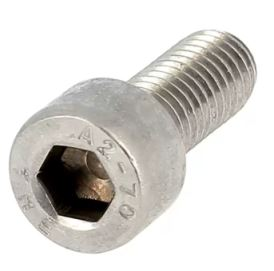

### Set screws

**M3-12 grub** refers to a grub screw/set screw (3mm diameter, 12mm length)

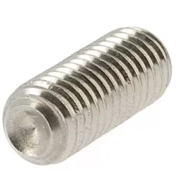

### Nuts

**M3 nut or M5 nut** refers to standard nuts with a diameter of 3mm or 5mm


**M3 nyloc nut** or **M5 nyloc nut** refer to **locking** nuts with a diameter of 3mm or 5mm

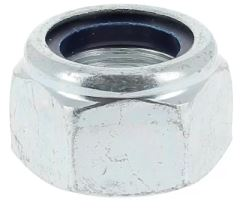


## Notes about BrailleRAP/BrailleRAP XL

BrailleRAP now exists in 2 different models: **BrailleRAP** and **BrailleRAP XL**.

**BrailleRAP** is the original version and can accommodate paper sheets of **A4** or smaller.

- Braillerap_v6-5-1_600x400-planche1.svg
- Braillerap_v6-5-1_600x400-planche2.svg

**BrailleRAP XL** is a larger version and can accommodate paper sheets of **A3** or smaller.

- brapxl-v6-6-planche1_900x400.svg
- brapxl-v6-6-planche2_900x400.svg

*Assembly of the 2 versions is largely similar. The main differences are:*

- *Assembly of the paper tray*
- *The number of paper rollers*
- *The length of the linear rods and belts*
- *BrailleRAP XL requires more precise mechanical assembly*

---

# 1. Wooden Enclosure Assembly

## 1.1 Wooden Enclosure Assembly

**Equipment:**

- 5 x laser cut plywood pieces (5mm): 
  
  - FACE
  
  - BACK
  
  - BOTTOM
  
  - LEFT_SIDE
  
  - RIGHT_SIDE

- Wood glue

- Blue painter's tape

**Steps:**

1. Prepare the 5 parts: FACE, BACK, LEFT_SIDE, RIGHT_SIDE and BOTTOM. Carefully identify the orientation of the sides (right and left) and the bottom. Use the holes to orient the parts as shown in the picture below:


2. Apply glue to the notches and assemble the 5 parts
3. Secure with painter's tape until the glue is fully dry

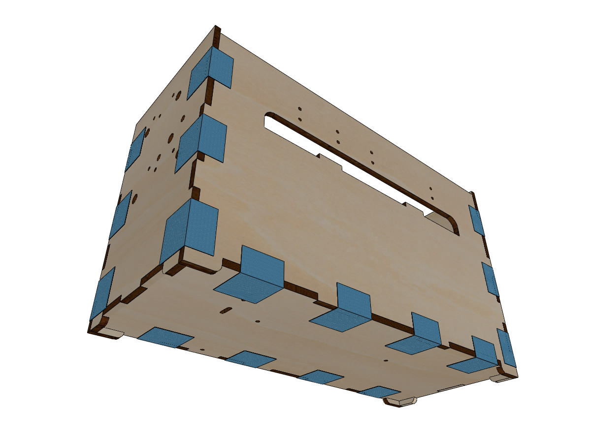

## 1.2 Installing the Door Stops

**Equipment:**

- Assembled wooden enclosure
- 4 x wooden discs (from lid laser cutting)
- Wood glue

**Steps:**

1. Glue the 4 wooden discs to the interior of the back panel of the enclosure. These discs will hold the access hatch inside the machine.

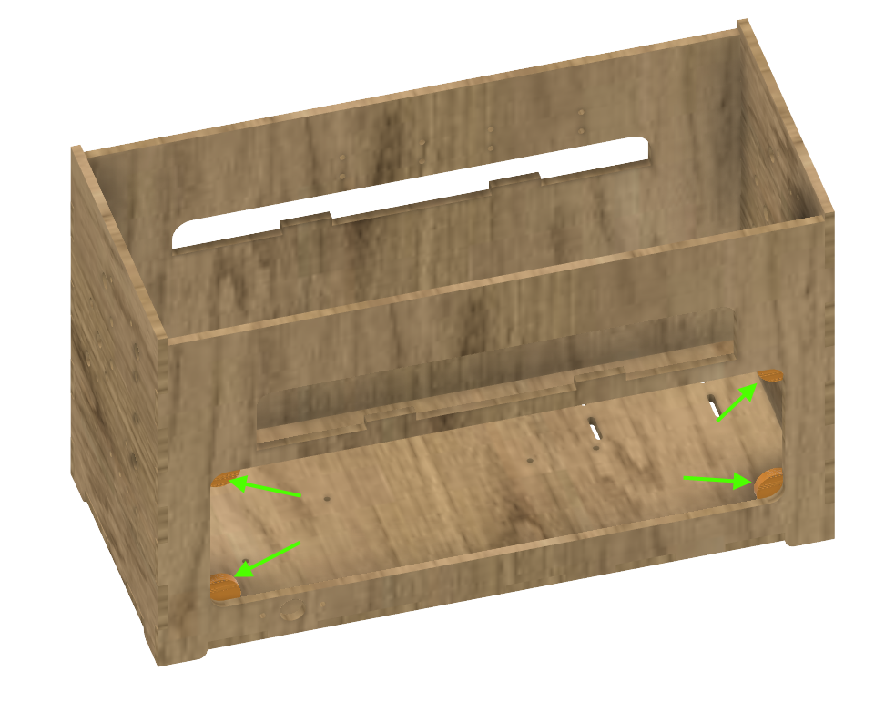

---

# 2. Component Preparation

## 2.1 Paper Tray Assembly

**Equipment:**

- Upper and lower paper supports
- Wood glue
- Clamping pliers

**Steps:**

1. Identify the upper and lower paper support parts.

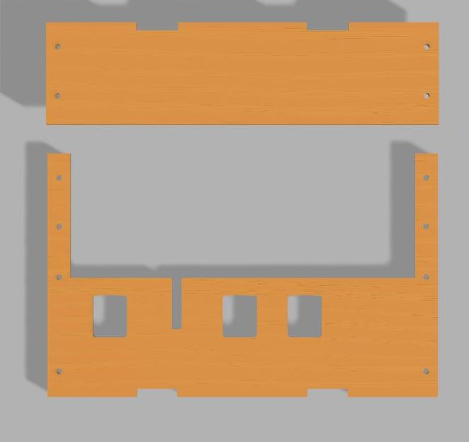

2. Glue the lower support to the underside of the upper support.

**Attention:** The 2 parts must be perfectly aligned. Place screws in the holes to properly align the parts. There must not be any gap between the two pieces, or the paper could catch and jam there. Clamp the parts together tightly with the pliers.

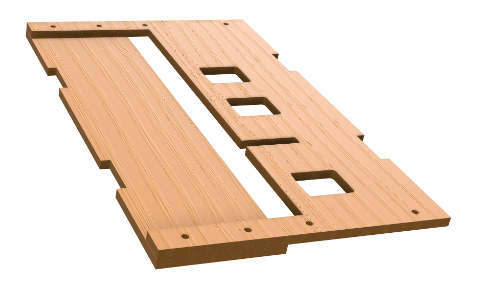

## 2.2 Braille Stylus Preparation

**Equipment:**

- 1 x whetstone
- 1 x M3-16 dog point grub screw

**Steps:**

1. File down the edge of the tip to match the shape shown in the illustration.

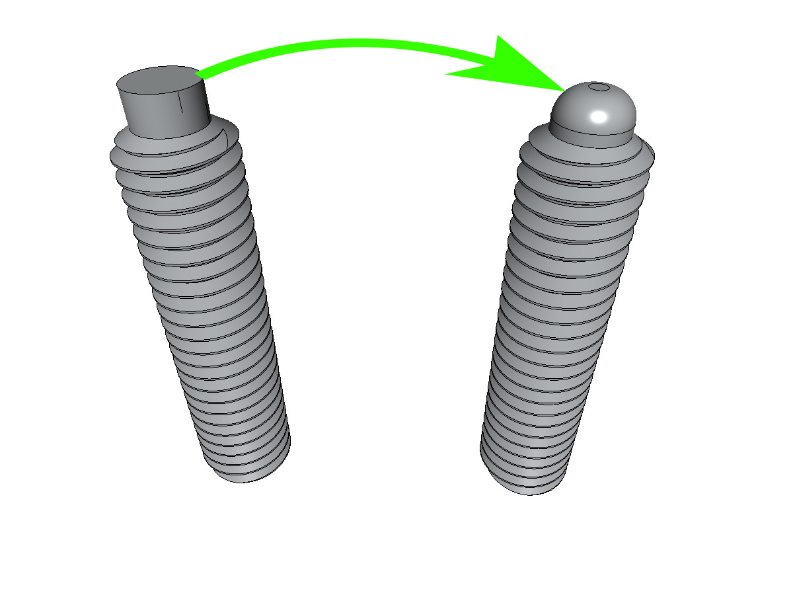

## 2.3 Axis Supports Preparation

**Equipment:**

- 3D printed parts:
  - BOTTOM_AXIS_left2
  - TOP_AXIS_left2
  - TOP_AXIS_right2
- 8mm drill bit
- 6 x M3 nuts
- 6 x M3-12 grub screws

<div class="admonition note">
<p>Verify that the 8mm rods slide into their holes, as the hole size may vary depending on the print quality of the plastic parts. If necessary, enlarge the holes with an 8mm drill bit.</p>
</div>


**Steps:**

1. Identify the 3 parts to be assembled.

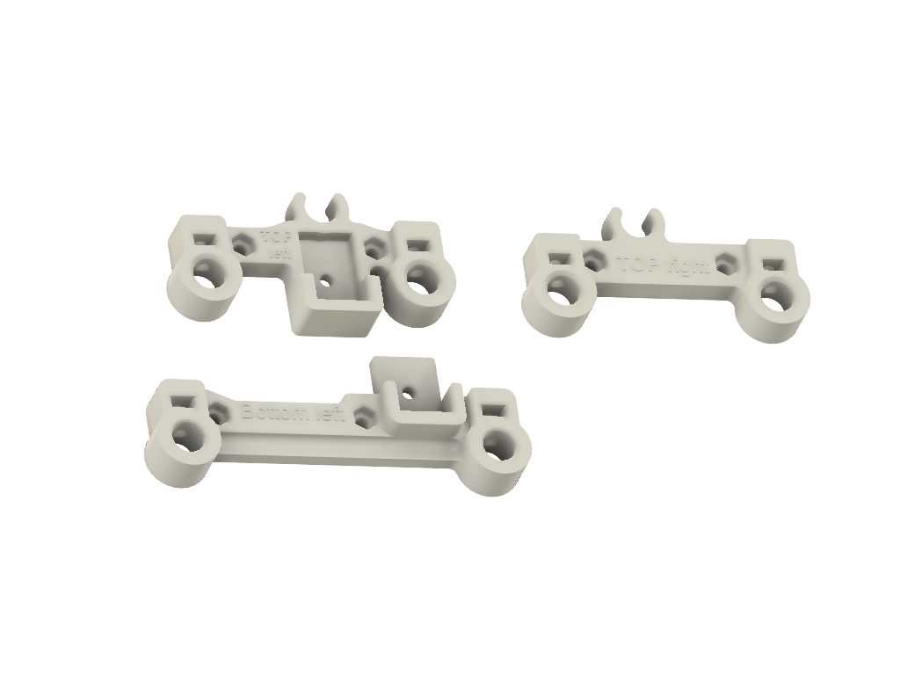

2. Insert an M3 nut into each of the rectangular holes in all 3 parts, then thread in the M3-12 grub screws.

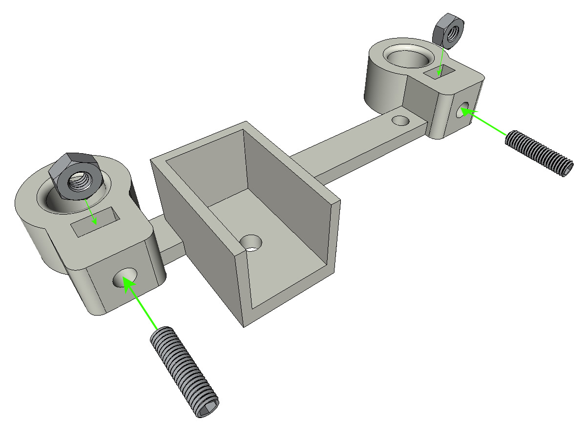

3. Ensure the tip of the screw does not protrude into the hole for the 8mm rods:

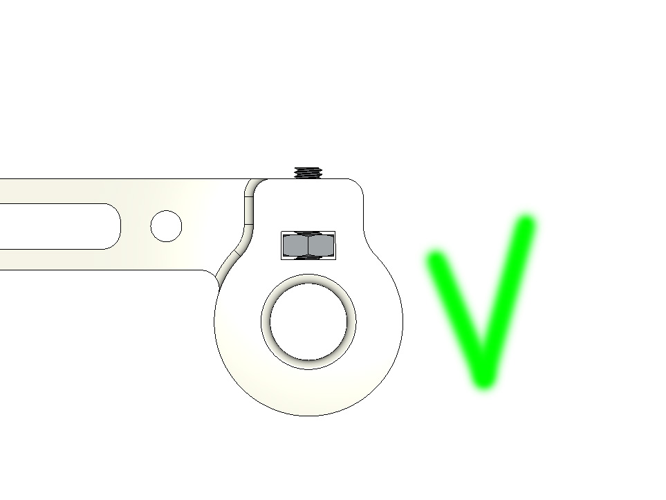

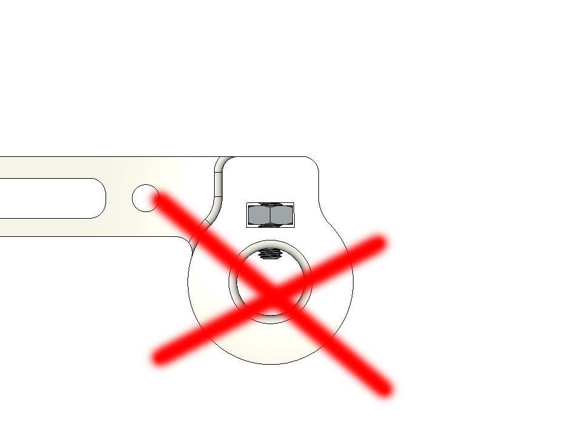

## 2.4 Paper Roll Preparation

**Equipment for BrailleRAP:**

- 3D printed parts:
  - 3 x ROLL_joint3
- 1 x M3 tap
- 3 x O-rings
- 5 x M3-6 grub screws

**Equipment for BrailleRAP XL:**

- 3D printed parts:
  - 4 x ROLL_joint3
- 1 x M3 tap
- 4 x O-rings
- 8 x M3-6 grub screws

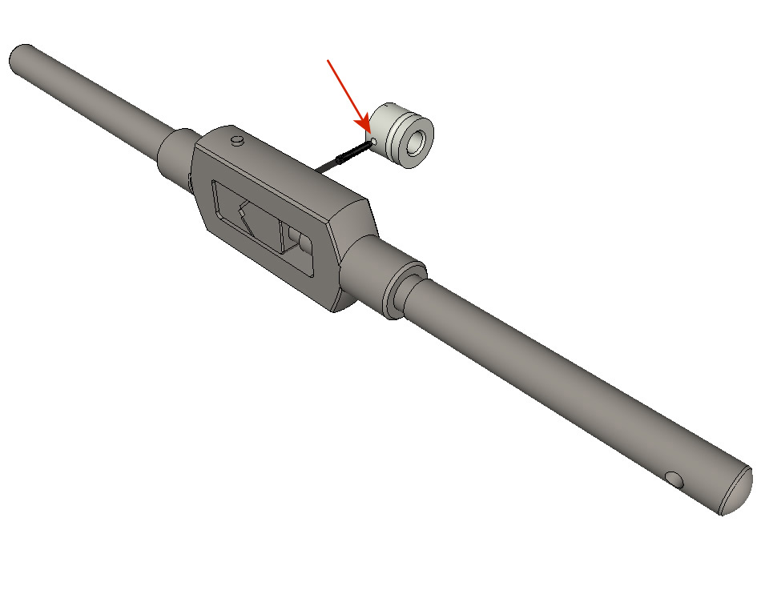

**Steps:**

1. Put the O-rings in the groove of the 3 or 4 ROLL_joint3:
   
   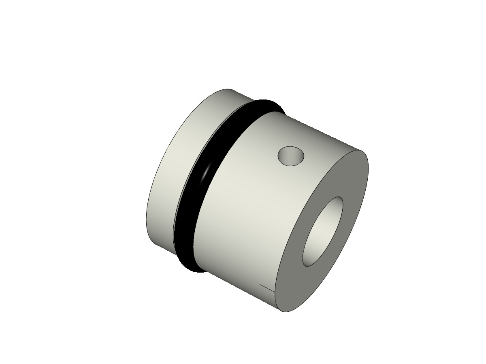

2. Insert the M3-6 grub screws, ensuring they do not protrude into the inside of the hole. You must be able to slide the roller over an 8mm shaft:

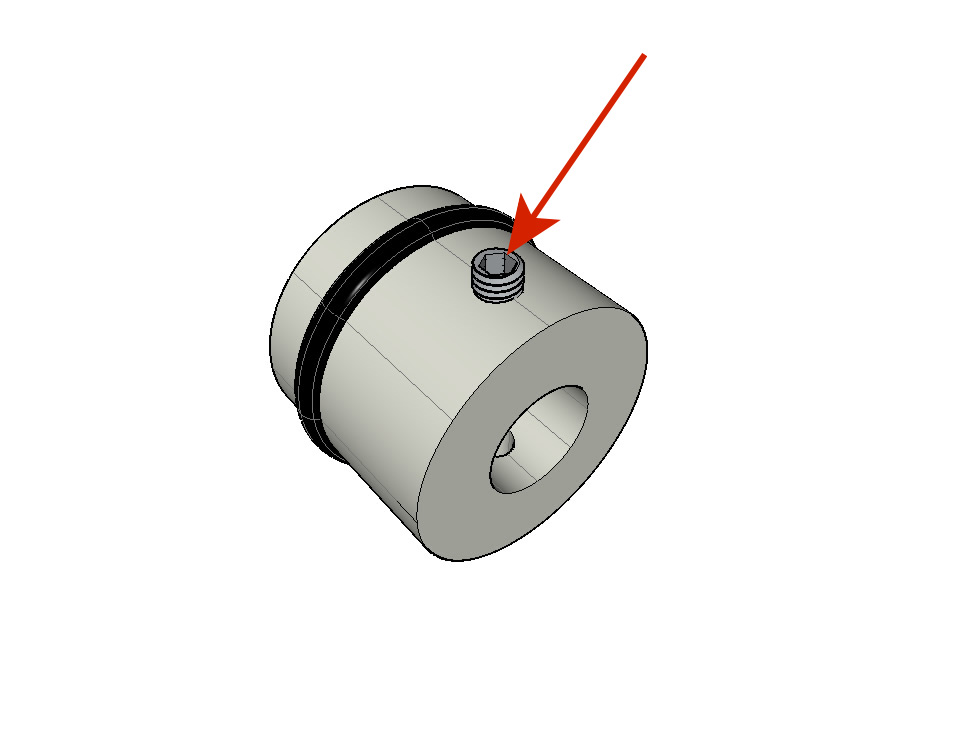

## 2.5 Paper Hold-Down Assembly (Step 1)

**Equipment for BrailleRAP:**

- 3D printed parts:
  - 3 x clipboard2_support
  - 3 x clipboard2
  - 3 x CLIPBOARD2_WHEEL
- 3 x M3-25 screws
- 3 x M3-20 screws
- 3 x GT2 belt tensioning springs
- 6 x M3 nyloc nuts

**Equipment for BrailleRAP XL:**

- 3D printed parts: 
  - 4 x clipboard2_support
  - 4 x clipboard2
  - 4 x CLIPBOARD2_WHEEL
- 4 x M3-25 screws
- 4 x M3-20 screws
- 4 x GT2 belt tensioning springs
- 8 x M3 nyloc nuts

**Steps:**

1. Position the clipboard **clipboard2** in relation to the support **clipboard2_support**.

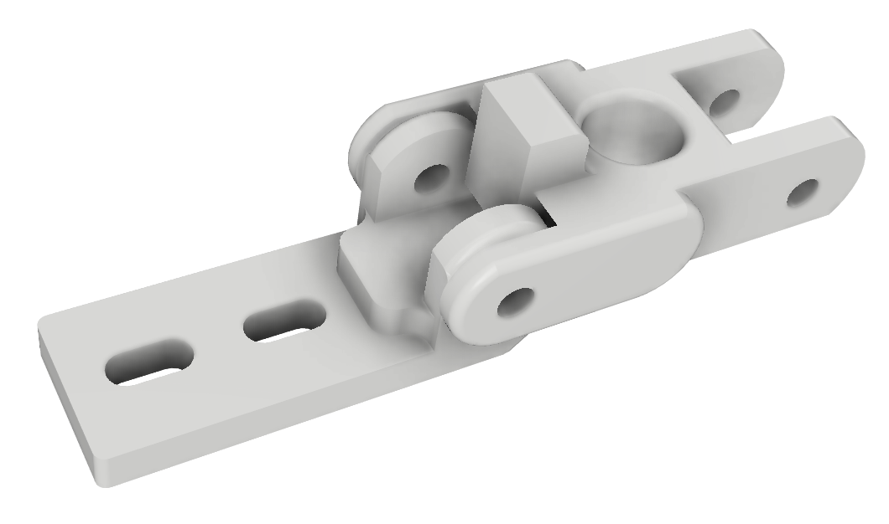

2. Position the spring between **clipboard2** and **clipboard2_support**.

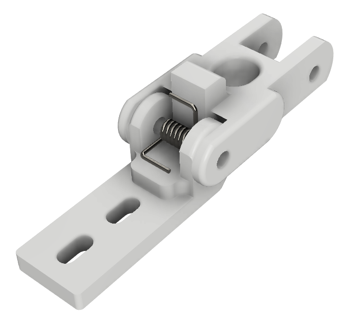

3. Assemble the spring with **clipboard2** and **clipboard2_support** with an M3-25 screw and an M3 nyloc nut.

**Note:** Do not tighten the M3 nyloc nut **clipboard2** and **clipboard2_support** must be able to move freely.
<div class="admonition note">
<p>Do not tighten the M3 nyloc nut **clipboard2** and **clipboard2_support** must be able to move freely.</p>
</div>

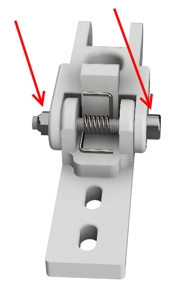

4. Assemble roller with **CLIPBOARD2_WHEEL** with **clipboard2** using an M3-20 screw and an M3 nyloc nut.

**Note:** Do not tighten the M3 nyloc nut **CLIPBOARD2_WHEEL** must be able to turn freely.
<div class="admonition note">
<p>Do not tighten the M3 nyloc nut **CLIPBOARD2_WHEEL** must be able to turn freely.</p>
</div>

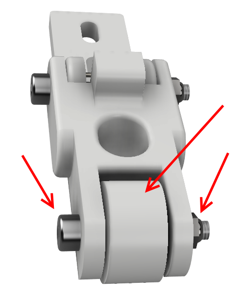

---

# 3. Motor and Drive Assembly

## 3.1 X Motor Preparation

**Equipment:**

- 3D printed parts:
  - XMOTOR_support3
  - XMOTOR_support3_1
- 1 x Nema 17 motor
- 4 x M3-8 screws
- 2 x M3 nyloc nuts
- 2 x M3-14 screws

**Steps:**

1. Insert the 2 M3 nyloc nuts into the printed part **XMOTOR_support3_1**.

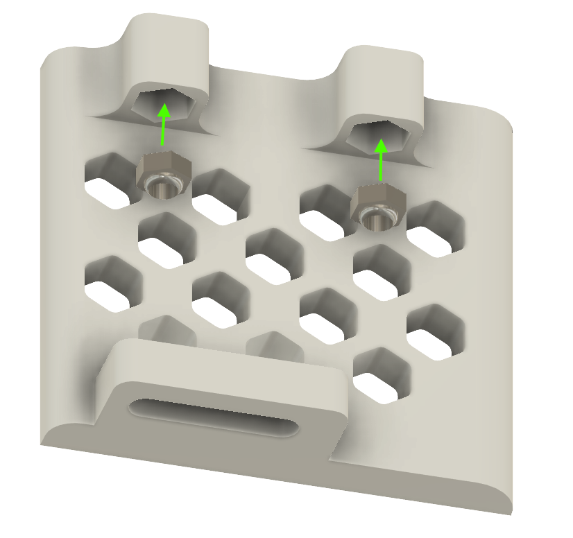

2. Join the two printed parts **XMOTOR_support3_1** and **XMOTOR_support3** with two M3-14 screws.

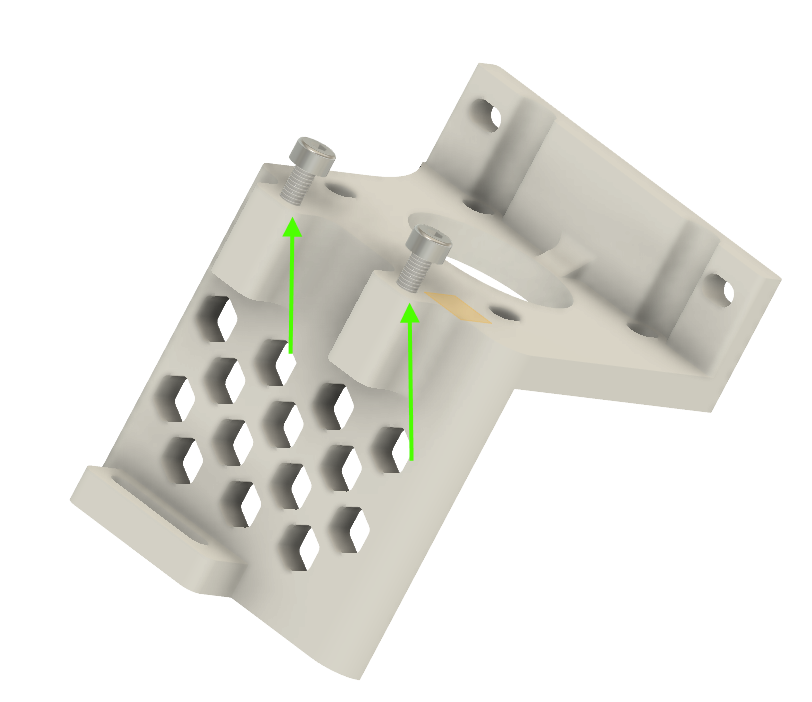

3. Mount the motor into its support with 4 M3-8 screws. Don't fully tighten the screws, as the motor needs some play for adjustment and will be secured later.

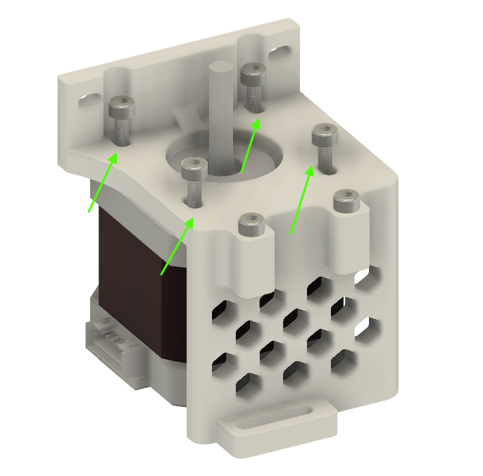

**Note:** Carefully note the position of the motor connector!
<div class="admonition note">
<p>Carefully note the position of the motor connector!</p>
</div>

## 3.2 Y Motor Preparation

**Equipment:**

- 3D printed parts:
  - YMOTOR_support2_200_1
  - YMOTOR_support2_200_2
  - YMOTOR_support2_200
- 1 x Nema 17 motor
- 1 x GT2 pulley (20 teeth, 5mm bore)
- 4 x M3-8 screws
- 2 x M3-12 screws

**Steps:**

1. Attach the pulley to the motor shaft, ensuring that at least one of the two screws is positioned over the flat section of the motor shaft and that the pulley teeth are facing toward the motor.

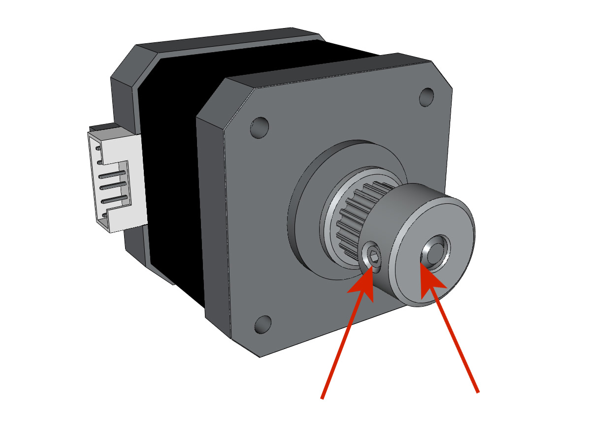

2. Tap both sides of the middle part of the support (**YMOTOR_support2_200_2**)

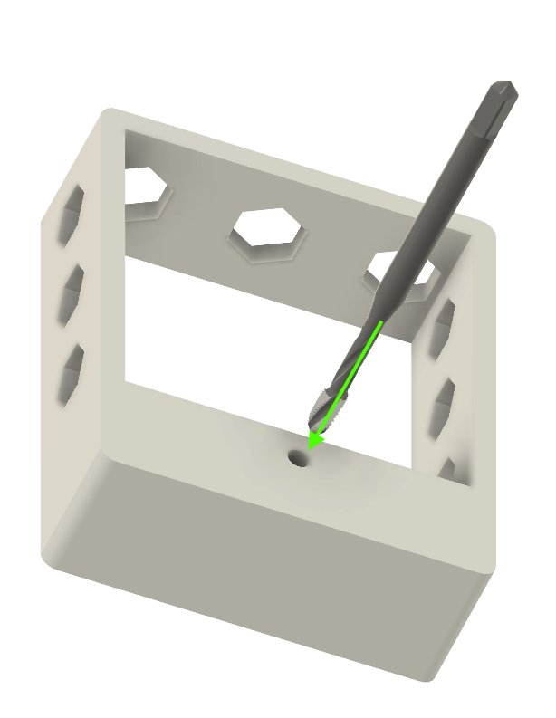
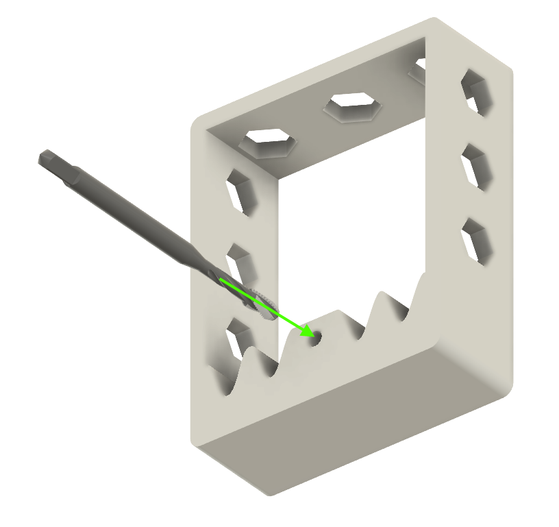

3. Attach the two printed parts **YMOTOR_support2_200_2** and **YMOTOR_support2_200_1** with M3-12 screws.

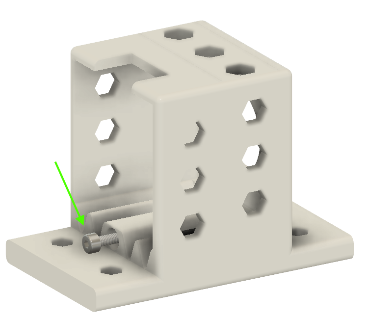

4. Attach the part **YMOTOR_support2_200** to the previous two with an M3-12 screw.

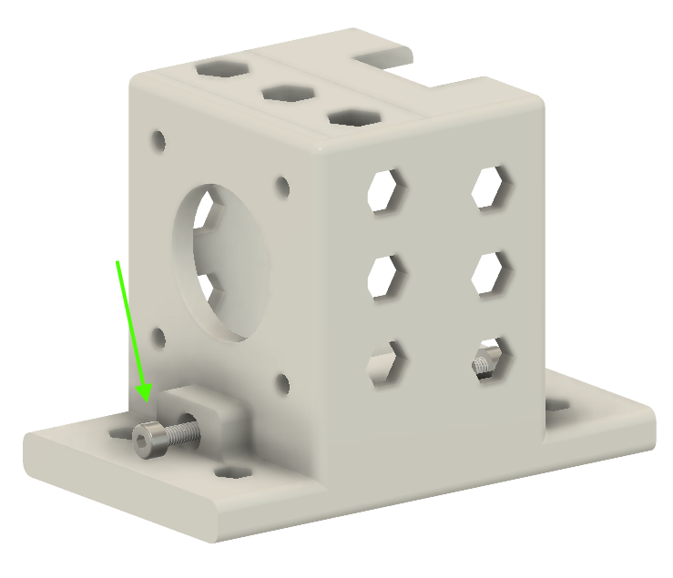

5. Mount the motor into its support with the 4 M3-8 screws, making sure that the connector is in the position shown in the illustration.

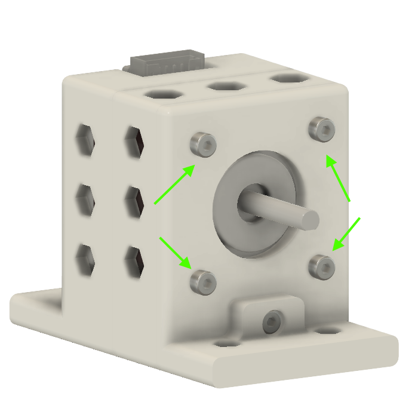

6. Insert the 4 M3 nyloc nuts into the motor mount. Hold them in place with a small piece of painter's tape.

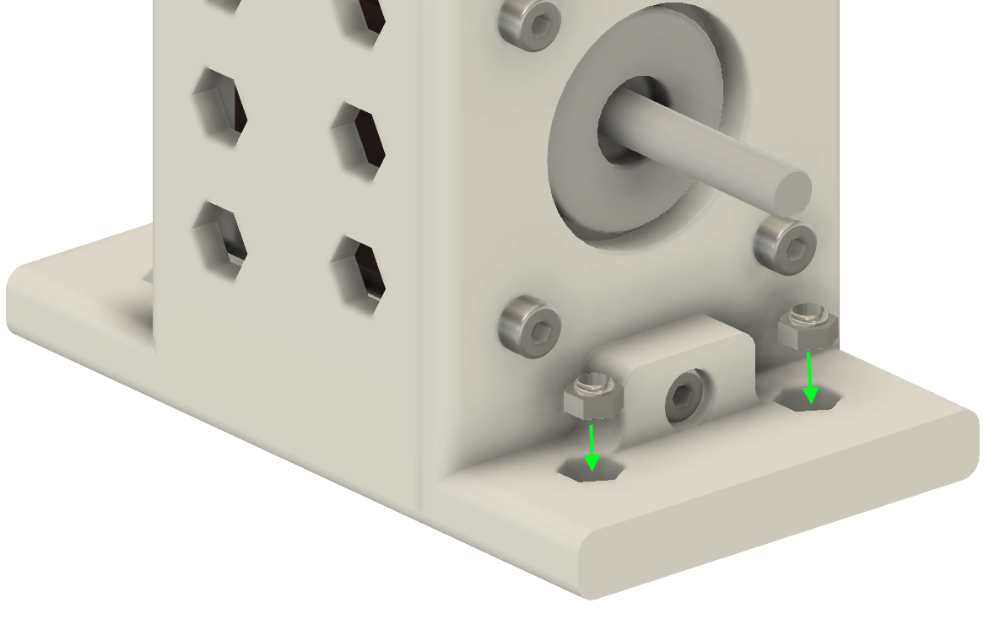

## 3.3 Limit Switch X Preparation

**Equipment:**

- 3D printed parts:
  - SWITCH_X_support
- 1 x wired limit switch
- 1 x M3-12 grub screw
- 1 x M3 nut
- 2 x M2.5-14 screws
- 2 x M2.5 nyloc nuts

**Steps:**

1. Insert an M3 nut, and thread in an M3-12 grub screw.

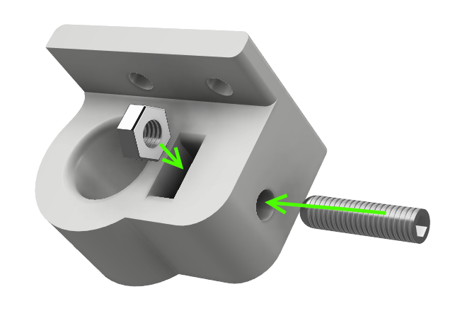
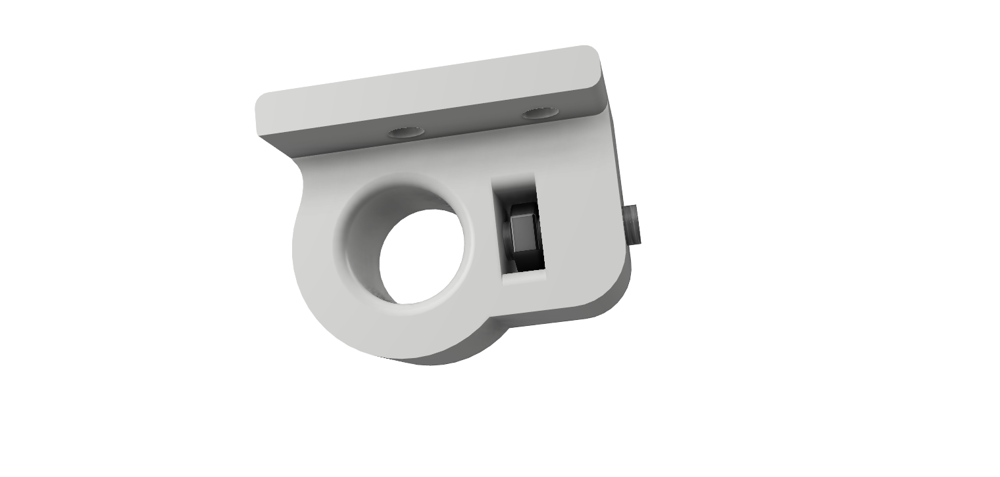

2. Attach the limit switch to its support (SWITCH_X_support) using M2.5-14 screws and M2.5 nuts.

**Note:** The limit switch is shown without wires in the image, but it must be wired before assembly.

**Note:** Note the position of the M2.5 screws. The screw heads must be positioned under the limit switch to provide clearance for the linear rod.

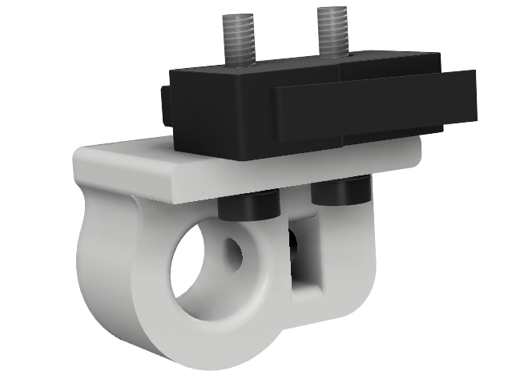

**Note:** It's better to use a straight aligned wired endswitch.
<div class="admonition note">
<p>It's better to use a straight aligned wired endswitch.</p>
</div>

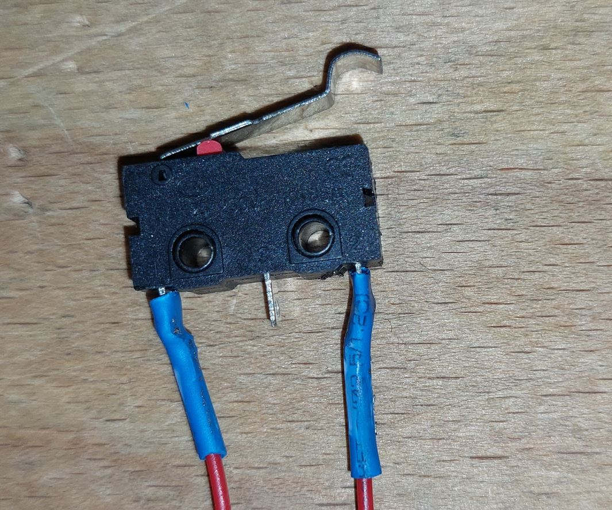

## 3.4 Solenoid Preparation

**Equipment:**

- 1 x solenoid
- 1 x 18mm spacer
- 1 x M3-16 grub screw (shaped tip)
- 1 x M3 nut
- 1 x M3 washer

**Steps:**

1. Thread the spacer completely onto the solenoid.

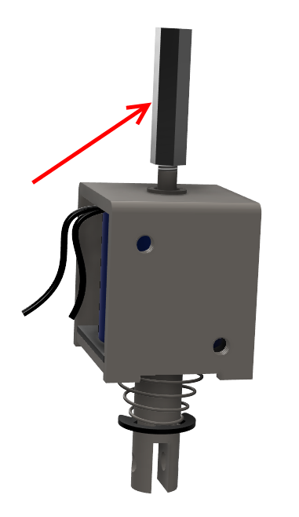

2. Install the M3-16 screw with the shaped Braille stylus tip, allowing it to extend approximately 6mm beyond the spacer.

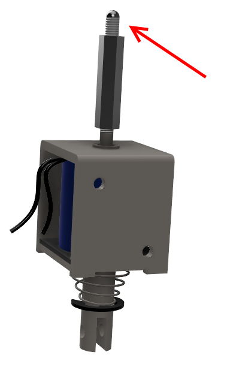

## 3.5 Solenoid Assembly

**Equipment:**

- Pre-assembled solenoid assembly
- 3D printed parts:
  - ELECTRO_MAGNET_housing2 or ELECTRO_MAGNET_Housing2_fit
- 2 x M3-8 screws
- 2 x M3 washers

**Steps:**

1. Select either **ELECTRO_MAGNET_housing2** or **ELECTRO_MAGNET_Housing2_fit**.
   
   **Note:** (On an older generation 3D printer, **ELECTRO_MAGNET_housing2** is preferred. On a modern, ultra-precise printer, **ELECTRO_MAGNET_Housing2_fit** is preferred. These are the same parts, but the mechanical tolerances are tighter on the **fit** version, allowing for better centering of the solenoid.)


2. Secure the solenoid to its support with the 2 M3-8 screws and 2 M3 washers.

**Attention:** Observe the exit side of the wires.

<div class="admonition warning">
  <div class="title">Attention</div>
  <p>Observe the exit side of the wires.</p>
</div>

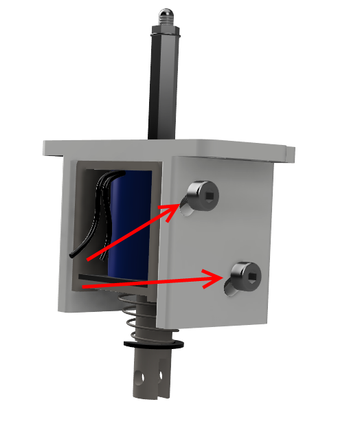

**Note:** Be sure to carefully align the edge of the plastic part with the edge of the solenoid, the solenoid axis **must** be vertical.

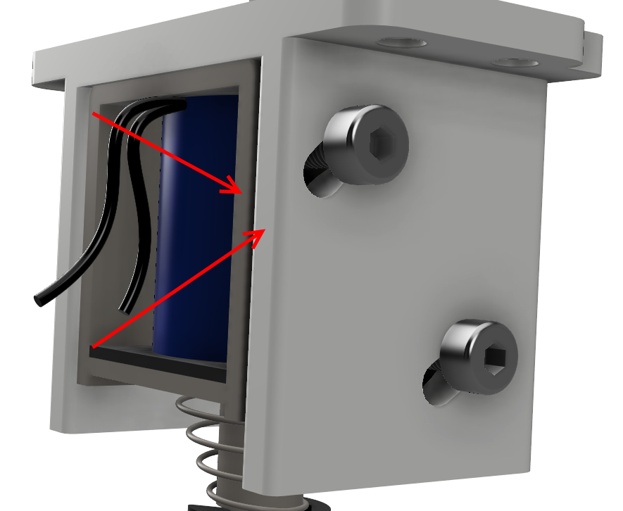


## 3.6 Vertical Axis Setup (Step 1)

**Equipment:**

- Assembled X motor assembly (XMOTOR_support2, XMOTOR_support2_1, stepper motor)
- 2 x M3-20 screws
- 2 x M3 nyloc nuts
- 2 x wide M3 washers

**Steps:**

1. Insert the 2 screws and the 2 washers from the outside. And attach the bracket with 2 NYL nuts without tightening.

**Note:** The gap will then allow to align the motor shaft with the vertical axis.

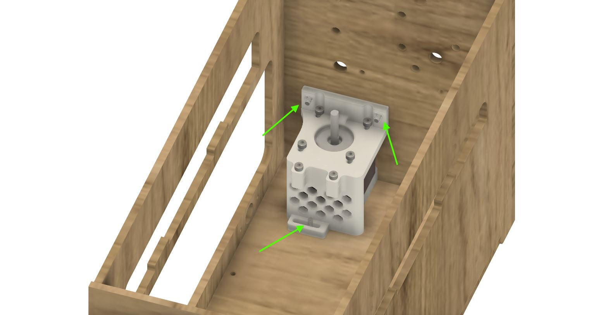
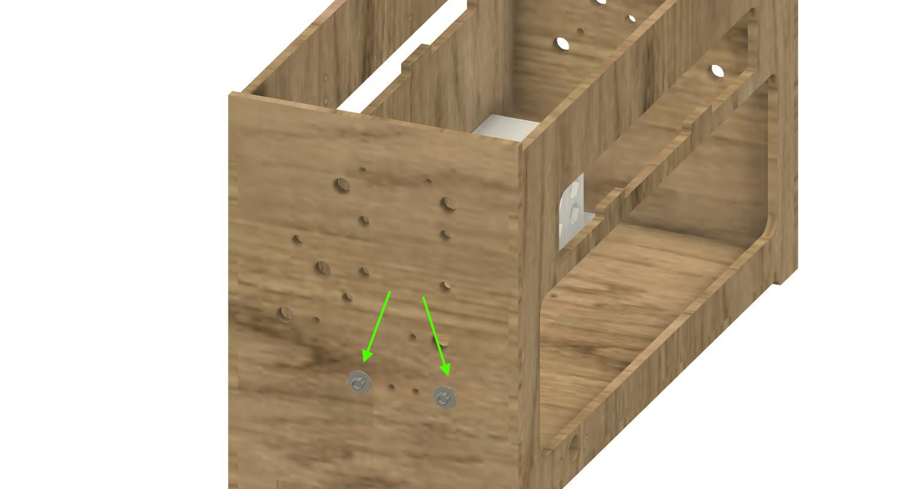

## 3.7 Y Motor Mount

**Equipment:**

- Assembled Y motor assembly (YMOTOR_support2_200 series + Nema17 motor)
- 4 x M3-14 screws
- 4 x wide M3 washers

**Steps:**

1. Insert the screws and washers from the outside and screw the support onto the crate so that it can still slide in the oblong holes.

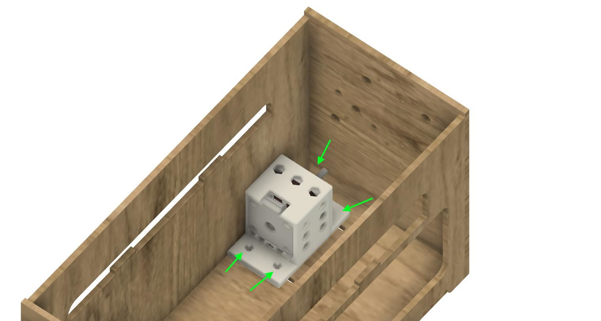
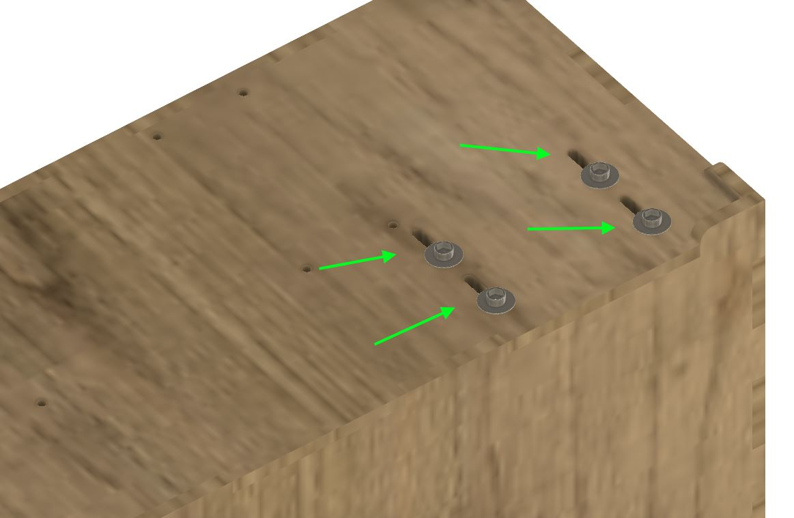

## 3.8 Assembling LEFT Shaft Supports

**Equipment:**

- 3D printed parts: BOTTOM_AXIS_left2, TOP_AXIS_left2 (pre-assembled with nuts & grub screws)
- 4 x M3-14 screws
- 4 x wide M3 washers
- 4 x M3 nyloc nuts

**Steps:**

1. Fix the supports of axis on the box the BOTTOM_AXIS_left2 and TOP_AXIS_left2 on the left leaving a little game (screw + washer outside and nut inside). The screws will be tight when the assembly is in place.

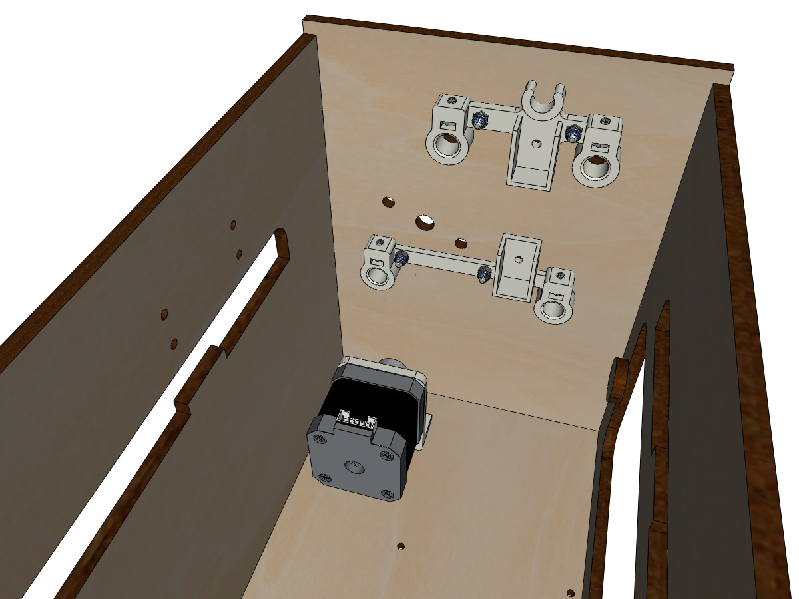
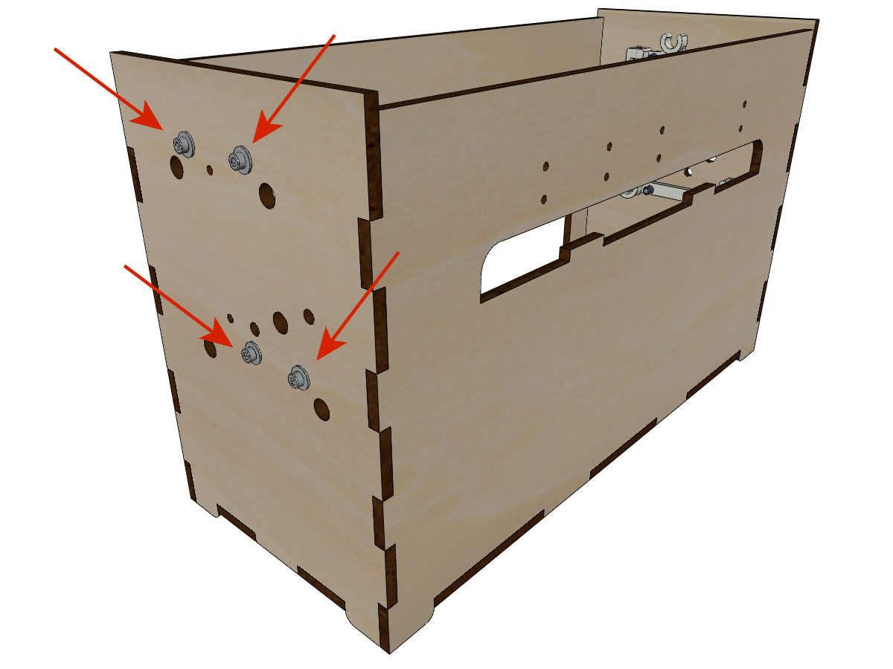

## 3.9 Assembling RIGHT Rod Supports

**Equipment:**

- 3D printed parts:
  - BOTTOM_AXIS_right2
    TOP_AXIS_right2 (pre-assembled with nuts & grub screws)
- 4 x M3-14 screws
- 4 x wide M3 washers
- 4 x M3 nyloc nuts

**Steps:**

1. Fix rod supports on the box with BOTTOM_AXIS_right2 and TOP_AXIS_right2 on the right with leaving some mechanical clearance (screw + washer outside and nut inside). The screws will be tight when all parts are in place.

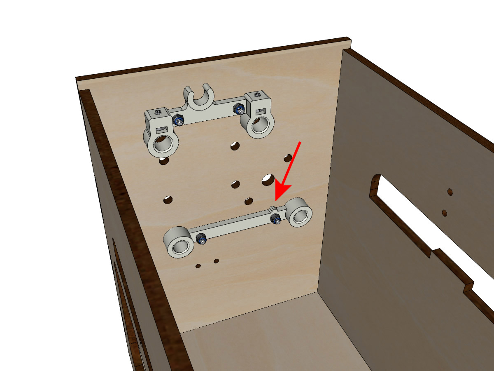
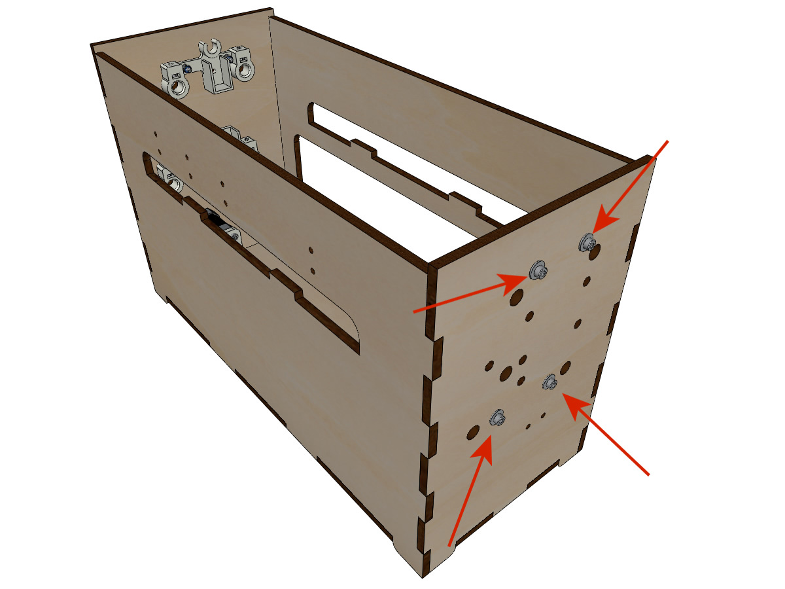

## 3.10 Fastening the Belt Tensioners

**Equipment:**

- 3D printed parts:
  - 2 x DRIVEN_PULLEY_housing
- 2 x M3-20 screws
- 2 x wide M3 washers
- 2 x M3 nyloc nuts

**Steps:**

1. Insert a NYL M3 nut into its housing and secure the DRIVEN_PULLEY_housing with a M3-20 screw and washer.

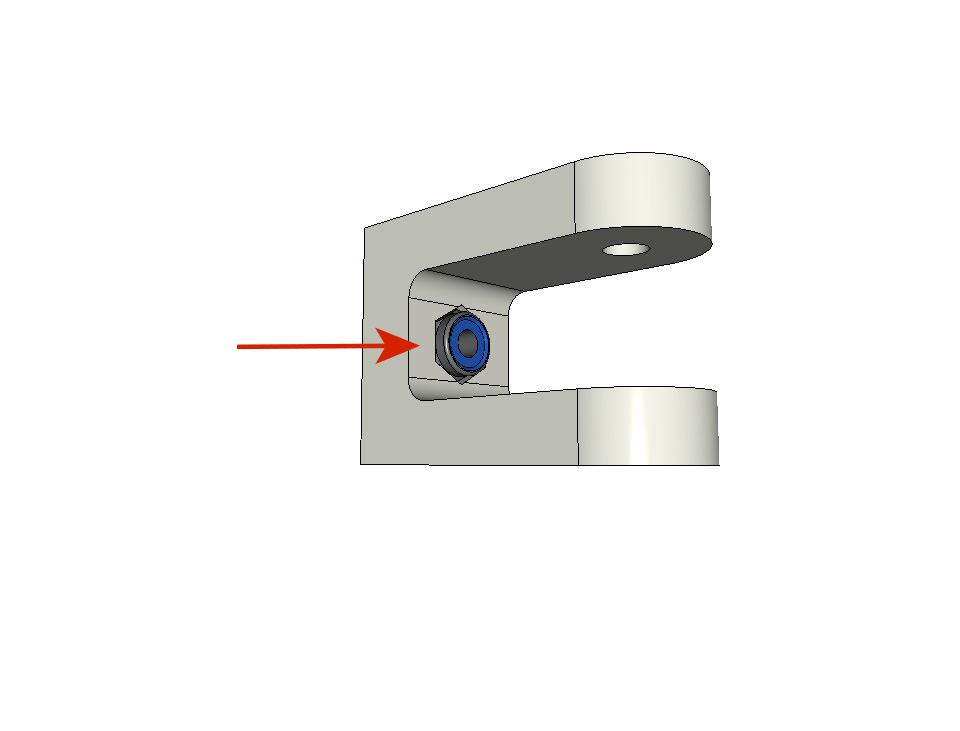
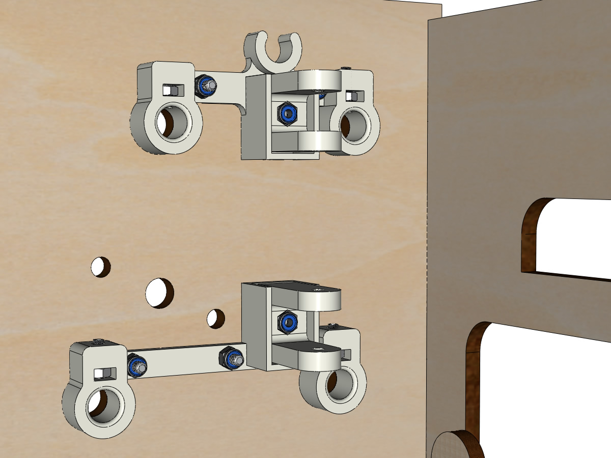
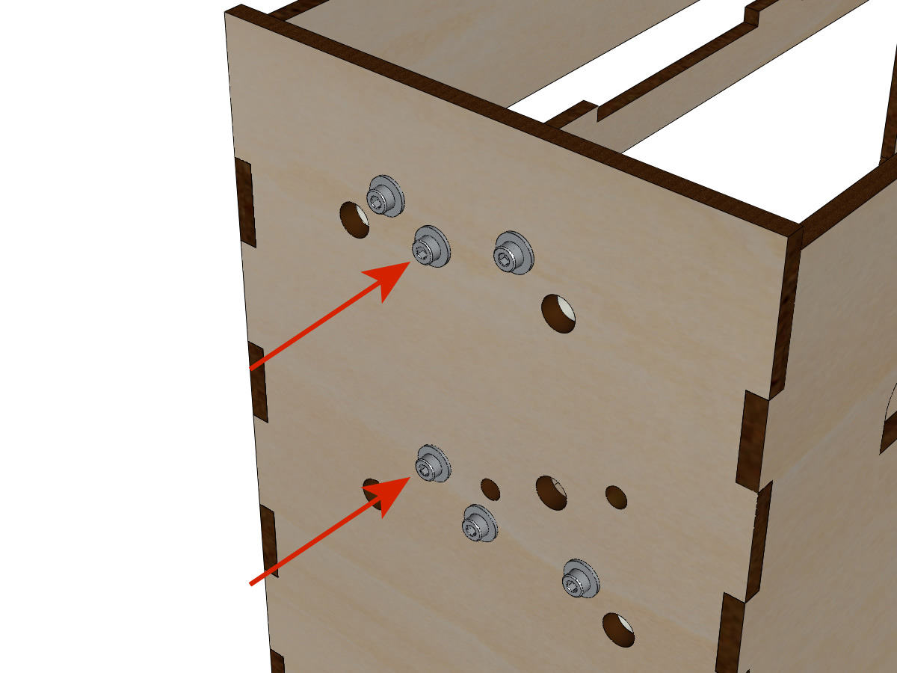

2. Leave a gap of ~5mm.

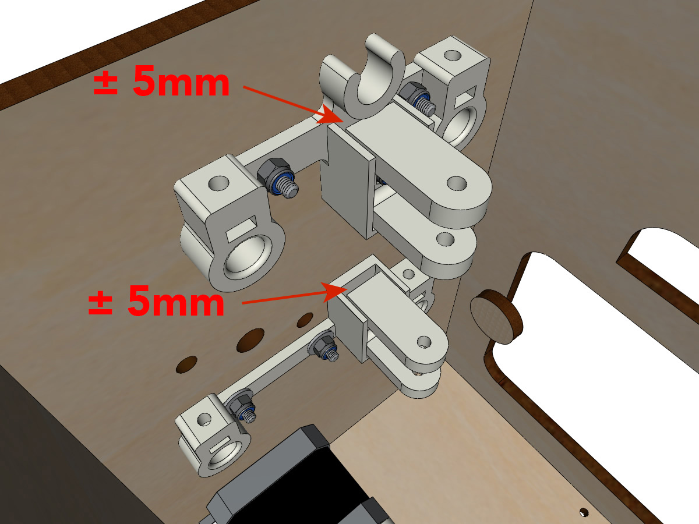

## 3.11 Free Pulleys Assembly

**Equipment:**

- 2 x free pulleys (20 teeth, 3mm bore)
- 2 x M3-25 screws
- 2 x M3 nyloc nuts

**Steps:**

1. Start by inserting the pulley then the M3-25 screw. Fasten with a NYL M3 nut without tightening too much.

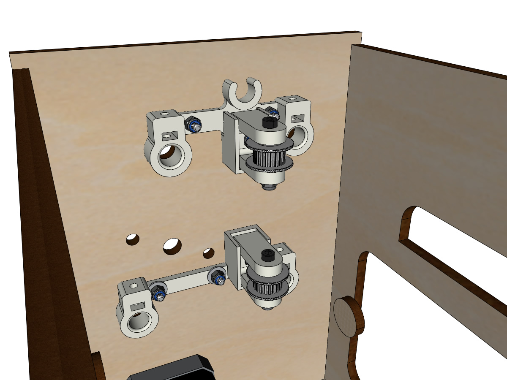

---

# 4. Carriage Assembly

## 4.1 Bottom Trolley Preparation (Step 1)

**Equipment:**

- Pre-assembled solenoid in housing
- 3D printed parts:
  - BOTTOM_trolley
  - ELECTRO_MAGNET_guide_fitxxx
- 3 x IGUS linear bearings
- 3 x cable ties (2.5 x 160)
- 4 x M3 nyloc nuts
- 2 x M3-16 screws
- 2 x M3-20 screws

**Note:** Select the best-fitting part from ELECTRO_MAGNET_guide_fit_5.8, ELECTRO_MAGNET_guide_fit_5.9, and ELECTRO_MAGNET_guide_fit_6.0. The spacer must slide freely with the least amount of play.

**Steps:**

1. Insert the 3 IGUS bearings into the BOTTOM_trolley support. Secure them with cable ties.

**Attention:** Lock the IGUS bearings in the groove. Do not overtighten the cable ties; they will be adjusted when the carriage is in place on the linear rails. Respect the position of the cable ties. The locking of the cable ties must be on the IGUS side and towards the front of the machine.


2. Assemble the solenoid (previously mounted in its housing) under the BOTTOM_trolley and the ELECTRO_MAGNET_guide with two M3-16 screws and two M3 nyloc nuts.

**Attention:** Depending on the print quality, it may be necessary to file the spacer housing. Also, the solenoid body must be as perpendicular as possible to the support plate (the axis must be centered in the hole that allows its passage). The solenoid wires must exit from the side where there is a single IGUS bearing.


3. Screw the two M3-20 screws (which will hold the strap) and 2 M3 nyloc nuts with the screw head underneath.


4. Fit a washer and tighten the M3 lock nut, ensuring that the stylus screw does not move into the spacer at the same time. The washer prevents the jam nut from getting caught in the spacer guide.


**Note:** The solenoid plunger must be able to move up and down freely without resistance.

## 4.2 Top Trolley Preparation (Step 1)

**Equipment:**

- 3D printed parts:
  - TOP_trolley
  - FEMALE_shape
- 3 x IGUS linear bearings
- 3 x cable ties (2.5 x 160)
- 1 x M3 tap
- 1 x M3-30 grub screw
- 1 x M3 blind nut
- 1 x M3 nut
- 2 x M3-12 screws
- 2 x M3 washers
- 2 x M3-20 screws
- 4 x M3 nyloc nuts

**Steps:**

1. Glue the thread of the cap nut and screw the M3-30 headless screw on the side **WITHOUT** hex hole
   
   

2. Place a lock nut on the blind nut.

3. Tap the FEMALE_shape 2/3 of the way from the top.


4. Adjust the M3-30 screw / blind nut assembly so it extends approximately 0.5mm.


5. Assemble the FEMALE_shape on the TOP_trolley with the M3-12 screws, the M3 washers and the M3 nyloc nuts.


6. Position the IGUS bearings on the TOP_trolley part.


7. attach the IGUS bearings with fixing collars

**Note:** Pay attention to the direction of the cable ties. The cable tie fasteners must face toward the walls of the machine. Lock the IGUS bearings in the groove, and don't overtighten the cable ties — they will be adjusted when the carriage is in place on the linear rails.


8. Fit the M3-20 screws and the M3 nuts.


## 4.3 Bottom Carriage Assembly (Step 2)

**Equipment for BrailleRAP:**

- 2 x linear shafts (Ø8mm, 330mm)

**Equipment for BrailleRAP XL:**

- 2 x linear shafts (Ø8mm, 470mm)

**Steps:**
**Note:** We did not represent the facade for readability reasons.

1. Push the bars halfway through the outside of the frame.


2. Push the endstop and its support on the Ø8mm bar on the back side.


**Note:** The screw on the switch bracket will be tightened later during adjustment.

3. Push the bottom carriage over the smooth bars.


4. Finish putting on the bars (the bars must not protrude into the wood of the box).

5. Tighten the 4 axis support screws on the body (2 on the left side and 2 on the right side) and the 4 grub screws on the axle supports sufficiently so that the axes do not slide in their housings.


## 4.4 Top Carriage Assembly (Step 2)

**Equipment for BrailleRAP:**

- 2 x smooth bars (Ø8mm, 330mm)

**Equipment for BrailleRAP XL:**

- 2 x smooth bars (Ø8mm, 470mm)

**Steps:**

1. Push the bars halfway through the outside of the frame.


2. Thread the top trolley over the rods.


3. Finish putting on the bars.

**Note:** The edge of the wood should remain visible.


4. Tighten the axle holder screws on the body on the left and right.


5. Screw the grub screws of the axle supports on the left and right.


---

# 5. Paper Handling System

## 5.1 Vertical Axis Mounting (Step 1)

**Equipment:**

- 3D printed parts: 2x KP08_support
- 2x KP08 bearings
- 4x M5-25 screws
- 4x M5 washers
- 4x M5 nyloc nuts

**Steps:**
**Note:** Before attaching the KP08, make sure the bearings are aligned in their housing. They may be delivered a little misaligned. In this case, insert a Ø 8mm bar and manually actuate it to straighten them.


1. Screw the KP08_support and the KP08 on the body a bit with the M5-25 screws, M5 washers and M5 NYL nuts.


2. Observe the position of the KP08 clamping rings.


## 5.2 Vertical Axis Mounting (Step 3)

**Equipment:**

- 1x linear shaft (Ø8mm, 100mm)
- 1x coupler (5x8mm)

**Steps:**

1. Thread the coupler onto the motor shaft (Ø 5mm hole at the bottom).


2. Thread the 100mm linear shaft from the top through the KP08 and into the coupler.


3. Rotate the linear shaft by hand to ensure that all elements are aligned and that the spindle continues to rotate freely.


4. The holes of the motor support are oblong and allow to align the motor with the vertical axis in the 2 dimensions.

5. Screw the first 2 screws of the motor on its support.


6. Slowly tighten the KP08 screws by turning the shaft by hand.

7. Screw the motor support screws onto the body slowly by turning the shaft by hand.

8. Remove the pin and finish screwing the last 2 screws of the motor on its support, then the support on the body.

## 5.3 Vertical Axis Mounting (Step 4)

**Equipment:**

- 2 x GT2 pulleys (20 teeth, 8mm bore)

**Steps:**

1. Screw the 2 screws at the bottom of the coupler onto the motor shaft, making sure that one of the screws is in front of the flat part of the motor shaft and that the bottom of the coupler is not resting on the motor.


2. Thread the 100mm axle into the KP08, the pulleys (respecting their positions) and the coupler.


3. Screw the 2 screws at the top of the coupler onto the vertical axis.


4. Leave the pulleys free without screwing them onto the axle. They will be screwed when the belt is in place.

5. Screw the screws of the KP08 clamping rings (2 screws per ring).


6. Make sure that the axle rotates easily and that the motor does not oscillate. If necessary, loosen the motor and support screws on the body to give them play and re-align.

## 5.4 Y Axis Mounting (Step 1)

**Equipment for BrailleRAP:**

- 2 x KFL8 bearings
- 1 x smooth rod (Ø8mm, 364mm)
- 1 x GT2 pulley (20 teeth, 8mm bore)
- 1 x closed GT2 belt (200mm)
- 4 x M5-18 screws
- 4 x M5 nyloc nuts
- 4 x M5 washers

**Equipment for BrailleRAP XL:**

- 2 x KFL8 bearings
- 1 x linear shaft (Ø8mm, 505mm)
- 1 x GT2 pulley (20 teeth, 8mm bore)
- 1 x closed GT2 belt (200mm)
- 4 x M5-18 screws
- 4 x M5 nyloc nuts
- 4 x M5 washers

**Steps:**

1. Fix the KFL8 on the left side with 2 M5-18 screws, 2 M5 washers and 2 M5 NYL nuts.


2. Fix the KFL8 right on the body with the KFL8_support, 2 screws M5-18, 2 washers M5 and the 2 nuts M5 NYL.


3. Thread the smooth bar halfway through the left side through the body and the KFL8.

4. In order, thread the GT2 20 tooth boron 8mm pulley, the closed belt and the 3 (A4) or 4 (XL) ROLL_joint3 (pay attention to the position of the O-ring). Put the belt closed on the pulley of motor Y and on the pulley of the axle.


5. Press the axle into the right KFL8 and cross it so that it protrudes ± 12mm from the body.


6. Tighten the screws of the KFL8 rings.


## 5.5 Y Axis Mounting (Step 2)

**Steps:**

1. Rotate the motor pulley by hand so that the pulley on the shaft aligns vertically with the motor pulley.


2. Move the Y motor / support assembly along the oblong holes under the body to tension the closed belt and tighten the 2 screws.


3. Tighten the 2 screws of the pulley of the axle.


## 5.6 Paper Guides Assembly

**Equipment:**

- 3D printed parts:
  - PAPER_GUIDE_left & right (BrailleRAP)
  - **OR** paper_guide_left_XL & right_XL (BrailleRAP XL)
- Laser cut parts: 
  - PAPER_support (5mm plywood)
- 4 x M3-16 screws
- 4 x M3-14 screws
- 8 x wide M3 washers
- 8 x M3 nyloc nuts

**Steps:**
**Note:** M3-16 screws (M3-18 if you don't have M3_16) are used for the holes where there are 2 thicknesses of wood.

**Note:** This step is the main difference between BrailleRAP and BrailleRAP XL.

BrailleRAP use part PAPER_GUIDE_left et PAPER_GUIDE_right.


BrailleRAP XL use parts paper_guide_left_XL and paper_guide_right_XL.


1. Assemble the paper guides on the plate with the M3-16 screws and M3 NYL nuts.


2. Repeat the operation for the right side.


3. Check that you can put a sheet of paper on the tray without that the sheet warps. If the sheet warps, try to remove the paper guides before clamping.


## 5.7 Paper Plate Bonding

**Equipment:**

- Laser cut parts:
  - PAPER_support (5mm plywood)
- Pre-assembled paper rolls: 3 x (BrailleRAP) or 4 x (BrailleRAP XL)

**Steps:**
**Note:** Glue the plate only if you are sure of the mounting that is in below. If you're not sure, you can just position the support plate, you will bond it at the end when The embosser will work.

1. Glue the notches that will be in contact. Insert the plate from the front and hold it firmly with tape during the drying time.


## 5.8 Paper Hold-Down Assembly (Step 2)

**Equipment for BrailleRAP:**

- 3 x pre-assembled CLIPBOARD units (from step 1)
- 6 x M3-14 screws
- 6 x wide M3 washers
- 6 x M3 nyloc nuts

**Equipment for BrailleRAP XL:**

- 4 x pre-assembled CLIPBOARD units (from step 1)
- 8 x M3-14 screws
- 8 x wide M3 washers
- 8 x M3 nyloc nuts

**Steps:**
**Note:** The oblong holes in the printed parts adjust the pressure of the CLIPBOARD on the paper.


## 5.9 Y Limit Switch Assembly

**Equipment:**

- 3D printed parts:
  - ENDSTOP_Y_support
  - ENDSTOP_Y_lever_weight
- 1 x endstop switch
- 2 x M3-14 screws
- 2 x M3-12 screws
- 1 x M3-20 screw
- 2 x wide M3 washers
- 3 x M3 nyloc nuts
- 2 x M3 nuts
- 2 x M2.5-14 screws
- 2 x M2.5 nyloc nuts

**Steps:**
**Note:** It's better to use an endstop with angled wire.


1. Tap the adjustment screw support with an M3 tap


2. Position the lever **ENDSTOP_Y_LEVER** in the support **ENDSTOP_Y_support**.


3. Fix the lever **ENDSTOP_Y_LEVER** to the support **ENDSTOP_Y_support** with an M3-20 screw and an M3-NYL nut

**Note:** Do not tighten the M3 nut, the lever must be able to rotate freely in his support.


4. Assemble the limit switch and the **ENDSTOP_Y_support** using M2.5-14 screws and M2.5 NYL nuts.


5. Position the M3-12 adjustment screw on the lever **ENDSTOP_Y_LEVER_weight**


6. Add an M3-NYL nut , 2 M3 nuts and an M3-12 screw on the lever **ENDSTOP_Y_LEVER_weight**


7. Assemble the limit switch assembly and the **ENDSTOP_Y_support** to the body using the M3-14 screws, M3 washers and M3 NYL nuts.


## 5.10 Carriage Belt Installation

### Bottom carriage belt

**Equipment for BrailleRAP:**

- 1 x GT2 belt (620mm)
- 2 x cable ties

**Equipment for BrailleRAP XL:**

- 1 x GT2 belt (960mm)
- 2 x cable ties

**Steps:**

1. Using a collar, attach the strap around the carriage screw with the teeth facing out.


2. Pass the belt in the free pulley then the pulley of the vertical axis.


3. Tension the belt by holding the carriage and fix the second end of the belt to its screw with a cable tie.

4. Finish tensioning the belt using the screw on the outside of the body.


**Note:** For now, do not tighten the pulley bolts on the axle.


### Top carriage belt

**Equipment for BrailleRAP:**

- 1 x GT2 belt (620mm)
- 2 x cable ties

**Equipment for BrailleRAP XL:**

- 1 x GT2 belt (620mm)
- 2 x cable ties

**Steps:**

1. Using a collar, attach the strap around the carriage screw with the teeth facing out.


2. Pass the belt in the free pulley then the pulley of the vertical axis.


3. Tension the belt by holding the carriage and fix the second end of the belt to its screw with a cable tie.

4. Finish tensioning the belt using the screw on the outside of the body.


---

# 6. Electronics and Wiring

## 6.1 Lid Clips Installation

**Equipment:**

- 3D printed parts: 2x LID_LOCK
- 4 x M3-14 screws
- 4 x M3 nyloc nuts

**Steps:**

1. Assemble the 2 LID_LOCK on the cover using the M3-14 screws, M3 washers and M3 NYL nuts.


## 6.2 Power Supply Base Plate Installation

**Equipment:**

- 3D printed parts: POWER_plate
- 2 x M3-14 screws
- 2 x M3 nyloc nuts

**Steps:**

1. Mount the power supply base plate.


## 6.3 Motor Wires Setup

**Equipment:**

- 2 x stepper motor cables (XH 2.54 4-pin to 6-pin)

**Steps:**

1. Check cable wiring. Wiring follows this pattern:

| board side | motor side |
| ---------- | ---------- |
| 1          | 1          |
| 2          | 4          |
| 3          | 6          |
| 4          | 3          |


## 6.4 MKS 1.4 Board Assembly

### Electronic board controller mount MKS 1.4

**Equipment:**

- MKS GEN 1.4 board
- 4 x M3-12 spacers
- 4 x wide M3 washers
- 8 x M3-8 screws

**Steps:**

1. Assemble the 4 spacers on the card.

**Note:** To easily perform the final adjustments, we recommend wiring the board outside the chassis. Once the embosser is functional, you can mount the board inside the embosser.

### Electronic board wiring for MKS 1.4

**General diagram:**


**Photo of the assembled board:**


### Laying the drivers on the electronic board

**Equipment:**

- MKS GEN 1.4 board
- 2 x DRV8825 drivers
- 6 x jumpers

**Steps:**

1. If the card is not supplied already equipped with jumpers, put in the places of the drivers of engines X and Y.


2. Push the drivers into X and Y slots.


### 12V Power Wiring

**Steps:**

1. place the 2 wires coming from the **POWER_plate** socket in the terminal block of the MKS board


### Adjusting motor drivers

**Steps:**
**Note:** This step must **IMPERATIVELY** be carried out **before** wiring the motors.

1. Check that you can connect the 12V power supply to the board (a last check to avoid sparks is better :-) )

2. Connect the 12 V power supply to the board.

3. for each driver, measure, with a multimeter, the voltage between the adjustment potentiometer and mass of the USB connection.


4. The measured voltage should be close to 0.6 V for DRV8825 drivers. If this is not the case, use a screwdriver to adjust the potentiometer setting and repeat the measurement.

5. Once the voltage measured on each driver is correct, you can proceed to the next step.

### Wiring of limit switches

**Steps:**

1. Wire the limit switches on the board.

2. The limit switch X (carriage) must be connected to the left connector (red)

3. The Y limit switch (paper detection) must be plugged into the left connector (blue)


### Connecting the motors to the board

**Steps:**

1. Connect the motors to the control board with cables.

2. Motor X (carriage) must be plugged into the left connector (red)


3. The Y motor (paper) must be plugged into the right connector (blue)


### Wiring of the electromagnet

**Steps:**

1. Connect the 2 solenoid wires and the freewheel diode. Pay attention to the diode orientation (white line indicates cathode).


## 6.5 MKS GEN-L V2.1 Board Assembly

### Electronic board controller mount MKS GEN-L V2.1

**Equipment:**

- MKS GEN-L V2.1 board
- 4 x M3-12 spacers
- 4 x wide M3 washers
- 8 x M3-8 screws

**Steps:**

1. Assemble the 4 spacers on the card.

**Note:** To easily perform the final adjustments, we recommend wiring the board outside the chassis. Once the embosser is functional, you can mount the board inside the embosser.

### Electronic board wiring MKS GEN-L V2.1

**General diagram:**


**Photo of the assembled board:**


### Laying the drivers on the electronic board MKS GEN-L V2.1

**Equipment:**

- MKS GEN-L V2.1 board
- 2 x DRV8825 drivers
- 6 x jumpers

**Steps:**

1. If the card is not supplied already equipped with jumpers, put in the places of the drivers of engines X and Y.


2. Push the drivers into X and Y slots.


### 12V Power Wiring MKS GEN-L V2.1

**Steps:**

1. place the 2 wires coming from the **POWER_plate** socket in the terminal block of the MKS GEN-L board


### Adjusting motor drivers MKS GEN-L V2.1

**Steps:**
**Note:** This step **HAS TO BE** carried out **before** wiring the motors.

1. Check that you can connect the 12V power supply to the board (a last check to avoid sparks is better)

2. Connect the 12 V power supply to the board.

3. for each driver, measure, with a multimeter, the voltage between the adjustment potentiometer and mass of the USB connection.


4. The measured voltage should be close to 0.6 V for DRV8825 drivers, if this is not the case, use a screwdriver to turn the potentiometer setting and redo the measurement.

5. Once the voltage measured on each driver is correct, you can proceed to the next step.

### Wiring of limit switches MKS GEN-L V2.1

**Steps:**

1. Wire the limit switches on the MKS GEN-L board.

2. The limit switch X (carriage) must be connected to the connector on the top left (red)

3. The Y limit switch (paper detection) must be plugged into the connector on bottom left (blue)


### Connecting the motors to the board MKS GEN-L

**Steps:**

1. Connect the motors to the control board with cables.

2. Motor X (carriage) must be plugged into the left connector (red)


3. The Y motor (paper) must be plugged into the right connector (blue)


### Wiring of the electromagnet MKS GEN-L 2.1

**Steps:**

1. Connect the 2 solenoid wire on the HBED connector of the MKS GEN-L 2.1 board.


---

# 7. Final Assembly and Calibration

## 7.1 Horizontal Alignment of the Top Carriage

**Steps:**

1. Loosen the pulley on the vertical axis to release the top carriage.


2. Horizontal alignment of the two carriages.

3. Move the upper carriage to align the impression (**FEMALE_shape**) with the top of the Braille stylus.

4. Use the fixing screws of the **FEMALE_shape** to align the impression with the top of the Braille stylus.

5. When the alignment is satisfactory, tighten the fixing screws of the **FEMALE_shape**.


## 7.2 Vertical Alignment of the Two Carriages

**Steps:**

1. Loosen the pulley of the upper carriage on the vertical axis to free the top carriage.


2. Observing from the rear of the machine, raise the Braille stylus by pressing with the finger under the electromagnet.

3. Move the upper carriage to align the impression (**FEMALE_shape**) with the top of the Braille stylus.

4. Logically, the Braille stylus should enter slightly into the grub screw of the **FEMALE_shape**.


5. When the alignment is satisfactory, lock the upper pulley onto the vertical axis.


## 7.3 Carriage Adjustment and Paper Limit Sensors (X and Y)

**Steps:**

1. Adjust the position of the X limit switch. The sensor should activate before the bottom carriage belt attachment reaches the lower pulley of the vertical axis.

2. Using a sheet of paper, adjust the Y limit switch so that the sensor activates when a sheet is present under the sensor lever, and deactivates if the paper has moved past the lever.


## 7.4 Adjusting the Braille Point Depth

**Steps:**

1. Depending on the material you will use (paper, plastic, aluminum sheet), you will need to adjust the height of the die on the upper carriage using the blind nut.


## 7.5 Closing the Rear Panel

**Equipment:**

- 3D printed parts:
  - 2 x DOORLOCKER
- 4 x M3-16 screws

**Steps:**

1. Tap the fixing hole of the parts **DOORLOCKER**


2. Fix **DOORLOCKER** parts on the rear panel. Do not overtighten, **DOORLOCKER** part must move easily.


3. Put the rear panel on the frame.

4. Slide the **DOORLOCKER** parts to lock the door.

5. Tighten (gently) the screws.

## 7.6 X and Y Margin Fine Tuning

**Steps:**
Using software like Pronterface, you can adjust the distance between the endstops and the 0 position on the paper sheet. This is particularly useful for BrailleRAP XL.

The command reference is available here: [Set Home Offsets | Marlin Firmware](https://marlinfw.org/docs/gcode/M206.html)

1. To display the current offset values:
   
   ```
   M206
   ```

2. To adjust X offset:
   
   ```
   M206 X-xx.xx
   ```

3. To adjust Y offset:
   
   ```
   M206 Y-xx.xx
   ```

4. To save these values in EEPROM, use the command: 
   
   ```
   M500
   ```

---

**Assembly Complete!** Your BrailleRAP is now ready for calibration and use.