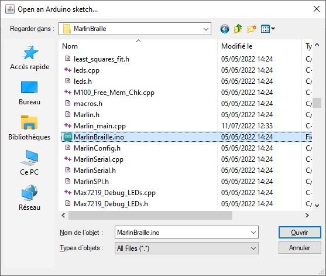
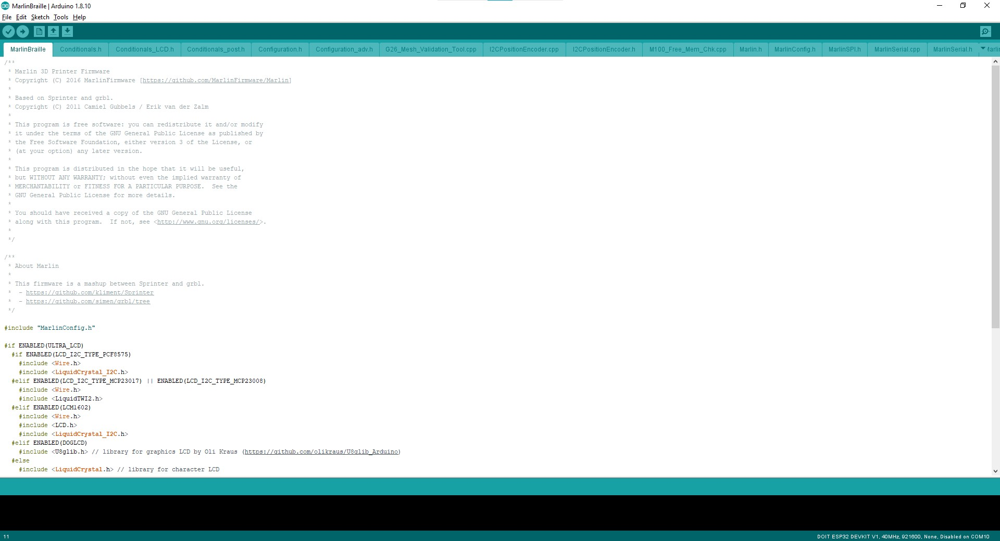
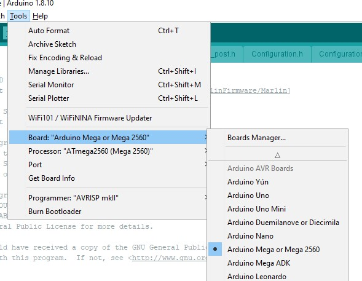
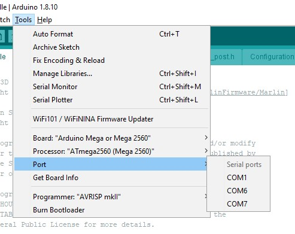
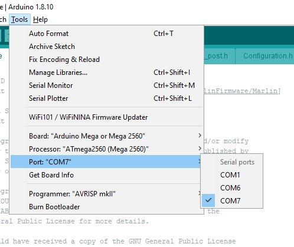
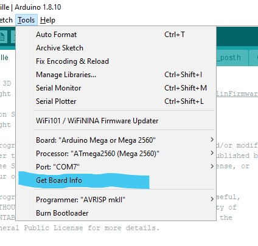
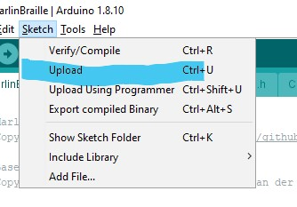
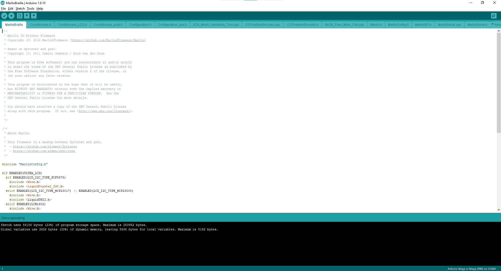

# Uploading firmware  (MKS 1.4 or MKS GEN L 2.1)  

This setup can be applied on all Arduino 2560 + RAMPS compatible board. ie :
- Arduino Mega 2560 + RAMPS 1.3
- Makerbase MKS GEN 1.3
- MakerBase MGS GEN-L V2.2

You can find the controller firmware source code in **MarlinBraille** directory of [github BrailleRAP project](https://github.com/braillerap/BrailleRap/tree/master/MarlinBraille)  
 
   
You may choose to upload the firmware on the controller before setting it up in the BrailleRAP. It will be easier to complete the wiring and first tests.  
   

## Uploading firmware  

### Setup Arduino environment 
 Plug the controller board with the USB cable on your laptop.   
 Open the file MarlinBraille.ino in **MarlinBraille** directory with the arduino environment.  
   
   
   
      

 Select  Arduino Mega 2560 in menu **Tools/Board**  
      

 Select the communication COM port in menu** Tools/port **(usualy the COM port is the upper one)  
      
      
   

 You can check the connexion by using the menu Tools/ Get board info  
      
   
   
 Arduino environment should display a dialog box like this   
      
   
### Uploading firmware  
 You can now use the menu Sketch/upload  
   
   

 The Arduino software will now take a few minutes to compile the firmware and upload it to the controller board  
   
   
 At the end check if there is no error message  
   
   
 The board is now ready to use with your BrailleRAP.  
   
 