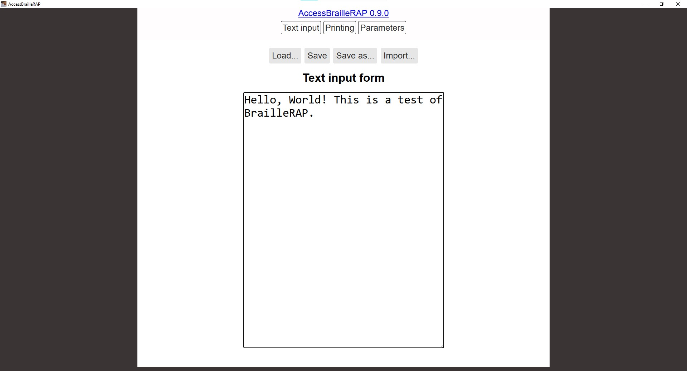
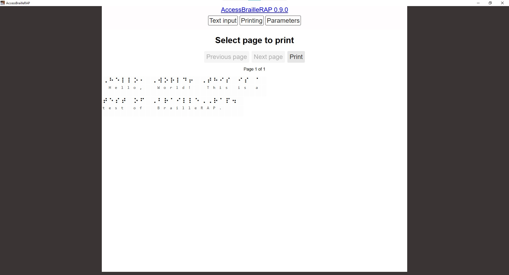

# Getting Started with BrailleRAP

Welcome to BrailleRAP, the open-source solution for Braille transcription and tactile printing. This guide will help you get started with AccessBrailleRAP, covering installation, key features, and basic usage.

## 1. What is BrailleRAP?

BrailleRAP provides accessible tools for creating and printing Braille content. AccessBrailleRAP is the software component that allows users to input text, translate it into Braille, and send it to your BrailleRAP embosser for printing.

## 2. Key Features of AccessBrailleRAP

AccessBrailleRAP offers a range of functionalities designed to make Braille production straightforward:

* **Text input & editing:** Easily enter and modify text within the application.
* **Braille translation:** Utilises the `liblouis` braille translator for accurate conversion of text to various braille codes.
* **Print functionalities:** Send your translated braille content directly to a connected BrailleRAP embosser.
* **Parameter settings:** Adjust various settings related to braille translation and printing to suit your specific needs.
* **Accessibility features:** Designed with accessibility in mind, though specific features would be detailed in the main user manual.
* **SVG import (DesktopBrailleRAP context):** While not directly in AccessBrailleRAP, the broader BrailleRAP ecosystem (DesktopBrailleRAP) supports importing SVG files for tactile graphics.
* **Pattern usage (DesktopBrailleRAP context):** The ecosystem also facilitates the use of patterns for tactile outputs.

## 3. Installation

The easiest and recommended way to install AccessBrailleRAP is by downloading the pre-built installers for your operating system from the [Releases page]([Releases · braillerap/AccessBrailleRAP · GitHub](https://github.com/braillerap/AccessBrailleRAP/releases)). This method allows you to get started quickly without needing to set up a development environment.

**Please Note for macOS Users:** Official pre-built installers are not currently available for macOS.

1. Navigate to the [AccessBrailleRAP Releases page](https://github.com/braillerap/AccessBrailleRAP/releases).
2. Locate the latest release.
3. Download the appropriate executable file for your system (e.g., `.exe` for Windows, `.deb` for Linux).
4. Follow your operating system's standard procedure for installing software from a downloaded package.


For detailed instructions on building AccessBrailleRAP from source, using Docker, or for specific operating system configurations, please refer to the [Detailed AccessBrailleRAP Installation Guide](DETAILED_INSTALLATION_BRAILLERAP.md).

## 4. Running AccessBrailleRAP

Once AccessBrailleRAP is installed via the pre-built binaries, simply execute the downloaded and installed application as you would any other software on your operating system.


## 5. Basic Usage: From Text to Tactile Braille

Once AccessBrailleRAP is successfully installed and running, you're ready to start translating and printing Braille. Follow these steps to create your first Braille output.

1. **Open AccessBrailleRAP:** Launch the application as you would any other program on your system. You should be greeted with the large **'Text input form'** 

2. **Input Your Text:**
   
   * Type directly into the **'Text input form'** area or paste text from another source. For example, type: `Hello, World! This is a test of BrailleRAP.`
     
      

3. **Translate to Braille:**
   
   * After entering your text, select the **'Printing'** button at the top of the page.
   * AccessBrailleRAP will process your text using the `liblouis` Braille translator, converting it into its Braille representation.

4. **Review the Braille Output:**
   
   * Below or beside the input area, you will see a new section displaying the translated Braille. This might appear as Braille dots, simulated Braille characters, or a visual representation of the Braille cells.
     
   * Carefully review this output to make sure it's correct (if possible).

5. **Adjust Settings (Optional, but Recommended for optimal printing):**
   
   * Before printing, you may wish to fine-tune some settings. To do this, select **'Parameters'** button at the top of the page.
   * Key settings include:
     * **Braille table:** This is where you select the Braille variant you need (for example, 'en - English computer braille as used in the U.K.')
     * **Characters per line:** How many characters you want on each line of Braille.
     * **Lines per page:** How many lines of Braille you want on each page
     * **Line spacing:** How big a gap do you want between each line of Braille
     * **Left margin:** How big a space you need to the left of the Braille
     * **Top margin:** How big a space you need at the top of the Braille
     * **Maximum right position:** This specified the last usable cell on a line of Braille
     * **Orientation:** You can choose between Portrait or Landscape for your Braille printing
     * **Braille Display** You can choose to display translated text associated with Braille
     * **Braille back translation** How is generated the text associated with Braille
     * **Braille / Text alignment** How the text and Braille are displayed 
     * **Communication serial port:** The USB virtual serial port (COM port) your software uses to communicate with the BrailleRAP machine
     * **Application language:** Select your preferred language
     * **Theme:** You can choose between a light and dark theme for the UI
   * Make any necessary adjustments you need, and the changes will automatically be applied.
     
     6* **Connect Your BrailleRAP Embosser:**
   - Ensure your BrailleRAP embosser is powered on and correctly connected to your computer via a USB cable.
   * Load the appropriate paper into your embosser.

6. **Print to BrailleRAP Embosser:**
   
   * Click the **'Printing'** button at the top of the page
   * Check your Braille is formatted and translated correctly
   * Click the **'Print'** button. This will send the Braille data directly to your connected BrailleRAP device.
   * The embosser then begin printing your Braille document.

### Serial Port Permissions (Linux Specific)

For Linux users, if AccessBrailleRAP cannot communicate with your BrailleRAP embosser, you may need to grant your user account access to the serial port.

**To resolve this:**

1. Open a Terminal.

2. Add your user to the `dialout` group:
   
   ```bash
   sudo usermod -a -G dialout $USER
   ```
   
   (Replace `$USER` with your actual username if you are not currently logged in as the target user).

3. Log out and log back in: This is crucial for the group changes to take effect.

## 6. Next Steps

* **Consult the full user manuals:** For in-depth information on all features, advanced settings, and troubleshooting, refer to the [AccessBrailleRAP User Manual](https://accessbraillerap.readthedocs.io/en/latest/) and the [DesktopBrailleRAP User Manual](https://desktopbraillerap.readthedocs.io/en/latest/).
* **Explore the BrailleRAP Wiki:** Visit the [DesktopBrailleRAP GitHub Wiki](https://github.com/braillerap/DesktopBrailleRAP/wiki) for community discussions, project updates, and shared experiences.

We hope you enjoy using BrailleRAP!