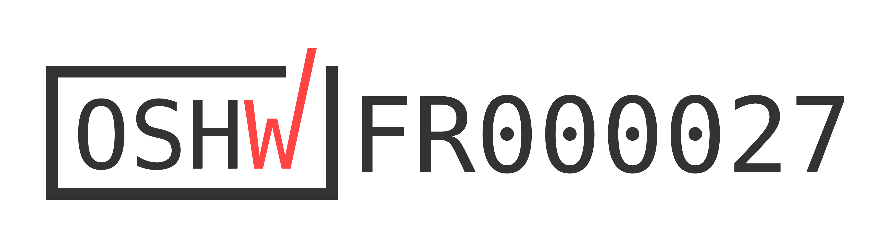

# BrailleRAP project history

## The beginning
In 2016 MyHumanKit, in partnership with Airbus Industries, organized a hackathon called Fabrikarium.

During the Fabrikarium several efforts were made to emboss Braille on 160g paper with hacked 3D printers.

The project was called BrailleRap.

In the BrailleRAP-SP team we saw those efforts as a proof of concept, but believed it would be better to design a specialized machine that is easy to reproduce.

## OpenBraille
In 2017 Carlos Campos starts the OpenBraille project and builds a braille embosser from recycled printer parts.

The project demonstrated that it is possible to guide a sheet of paper with the required precision for a braille embosser.

## BrailleRap-SP
In January 2018, we started with a few linear rails, Nema motors and 3D printed parts to try to building a braille embosser. After a few test runs, we began showing off examples of embossed braille text, and everyone was very excited. The BrailleRAP-SP project was born.

## BrailleRap
In 2022, in order to continue improving the project with other enthusiasts, we created the BrailleRap project.

## BrailleRap Cameroon
Also in 2022, the CCLab asked us to plan and run 4 public workshops in Cameroon. That was the start of BrailleRAP Cameroon.

2 workshops for the general public, 2 master classes in 4 cities in Cameroon in collaboration with ANIAAC (Association National pour l’Intégration et l’Accommodation des Aveugles du Cameroun) and Cameroonian partners. It lasted 3 weeks, and was an opportunity to bring the project back to the public: people who are blind, makers, associations, and schools. All this happened in an international context very different from our usual activities.

It was an experience full of amazing encounters, of stories, of experimentation, and of fresh ideas for new features and improvements.

## Hackaday Prize
Enriched by Cameroon’s experience, improvements have been made:

Created AccessBrailleRAP software using the open source liblouis library, greatly improving Braille transcription and making it possible to use the software with a screen reader.

Reinforced engine mounts for easier transportation.

Move the paper detection endstop to ease device setup.

Added an additional paper feed roller to allow the use of different media sizes.

In 2023, the project was presented at the international HackadayPrize competition in Pasadena, and won the 5th prize on 7/11/2023. The entire prize amount was dedicated to developing a prototype for using a BrailleRAP from a mobile phone.

.. raw:: html

    

	    <iframe width="560" height="315" src="https://www.youtube.com/embed/afmmY3M2pTo?si=0mn0qBLbHShMuEfu&amp;controls=0" title="YouTube video player" frameborder="0" allow="accelerometer; autoplay; clipboard-write; encrypted-media; gyroscope; picture-in-picture; web-share" referrerpolicy="strict-origin-when-cross-origin" allowfullscreen></iframe>
    

    

## Intensive workshops and funding
The international award strengthens the project’s reputation and provides an opportunity to organize around ten workshops and masterclasses across France, as well as in Belgium and the Democratic Republic of Congo.

"General public" workshops to raise awareness of the use of Fablab techniques and equip a family (hello Sophie and Noé), institutions (a tourist office federation, a museum, a media library and a town hall).

Masterclasses to demystify the complexity of BrailleRAP assembly and train fab managers in assembly and maintenance, with the aim of making it easier for them to run workshops.

These experiences have evolved both workshop management scenarios and the model, improving ease of workshop assembly, maintenance, embossing speed, and adjustments. This also marked the birth of the first A3 model, the BrailleRAP XL.

At the same time, we are submitting a funding application to the [**NlNet Foundation**](https://nlnet.nl/project/BrailleRAP/). Funding that the foundation has granted us. This is the first funding that has been monitored over time, and it allows us to develop the first versions of DesktopBrailleRAP and OpenStreetTouch. This is also an opportunity to continue experiments with blind and partially sighted people, as well as associations.

## Open Hardware Certification
After a busy year, including workshops in Congo and Belgium, the creation of the XL model, and many hours dedicated to developing DesktopBrailleRAP and OpenStreetTouch, as well as discussions about the open-source licensing model, we submitted a certification application to [**OSHWA**](https://www.oshwa.org) at the [**Dinacon**](https://2025.dinacon.org/) conference in the summer of 2025. On July 17, 2025, the application was accepted, and BrailleRAP is now Open Source Hardware certified.

 